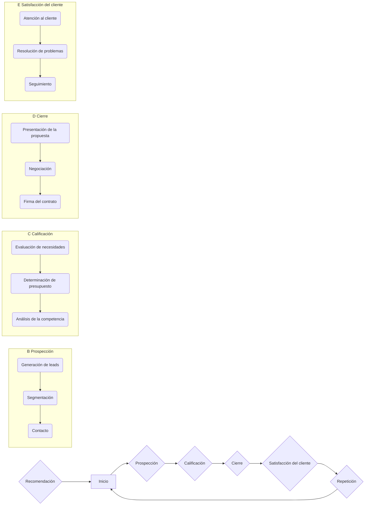

```mermaid
graph LR
    A[Inicio] --> B{Prospección}
    B --> C{Calificación}
    C --> D{Cierre}
    D --> E{Satisfacción del cliente}
    E --> F{Repetición}; G{Recomendación}
    F --> A
    G --> A

    subgraph B Prospección
        B1(Generación de leads) --> B2(Segmentación)
        B2 --> B3(Contacto)
    end

    subgraph C Calificación
        C1(Evaluación de necesidades) --> C2(Determinación de presupuesto)
        C2 --> C3(Análisis de la competencia)
    end

    subgraph D Cierre
        D1(Presentación de la propuesta) --> D2(Negociación)
        D2 --> D3(Firma del contrato)
    end

    subgraph E Satisfacción del cliente
        E1(Atención al cliente) --> E2(Resolución de problemas)
        E2 --> E3(Seguimiento)
    end
```