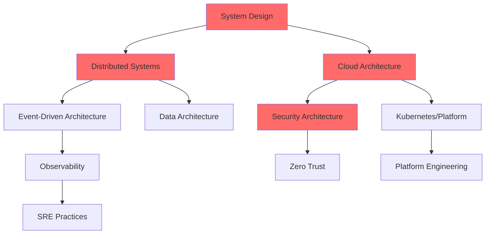

# Plan Maestro: Arquitectura de Software Avanzada
## Roadmap Completo de Arquitecto Staff+ Engineer

**Versión:** 1.0
**Fecha Inicio:** 2024-12-03
**Duración Total:** 12 meses
**Estado:** 🚀 En Ejecución

---

## 📋 ÍNDICE

1. [Visión General](#vision-general)
2. [Estructura del Programa](#estructura-programa)
3. [Roadmap Ejecutivo](#roadmap-ejecutivo)
4. [Temario Detallado](#temario-detallado)
5. [Matriz de Dependencias](#matriz-dependencias)
6. [Métricas de Progreso](#metricas-progreso)
7. [Recursos y Certificaciones](#recursos-certificaciones)

---

## 1. VISIÓN GENERAL {#vision-general}

### 🎯 Objetivo Principal
Convertirse en **Staff/Principal Software Architect** con capacidad de:
- Diseñar sistemas distribuidos de escala masiva
- Tomar decisiones arquitectónicas fundamentadas
- Liderar iniciativas técnicas cross-funcionales
- Mentorear arquitectos junior/senior
- Influenciar estrategia técnica de la organización

### 📊 Estado Actual vs Objetivo

| Área | Estado Actual | Objetivo 12 meses | Gap |
|------|---------------|-------------------|-----|
| **System Design** | Intermedio | Experto | 🔴 Alto |
| **Distributed Systems** | Básico | Experto | 🔴 Alto |
| **Cloud Architecture** | Intermedio | Experto | 🟡 Medio |
| **Security** | Básico | Avanzado | 🟡 Medio |
| **Leadership** | Básico | Avanzado | 🟡 Medio |
| **ML/AI Integration** | Avanzado | Experto | 🟢 Bajo |
| **DevOps/Platform** | Intermedio | Avanzado | 🟡 Medio |

### 🏆 Outcomes Esperados

**Al finalizar el programa podrás:**
- ✅ Diseñar arquitectura para 100M+ usuarios
- ✅ Liderar diseño de sistemas distribuidos complejos
- ✅ Tomar decisiones de trade-offs con confianza
- ✅ Pasar entrevistas de Staff+ Engineer en FAANG
- ✅ Escribir RFCs y ADRs de alta calidad
- ✅ Mentorear equipos técnicos
- ✅ Calcular capacity planning y cost optimization
- ✅ Diseñar para resiliencia y alta disponibilidad

---

## 2. ESTRUCTURA DEL PROGRAMA {#estructura-programa}

### 📚 Fases del Programa

```
FASE 1: FUNDAMENTOS ARQUITECTÓNICOS (12 semanas)
├── System Design Fundamentals
├── Distributed Systems Core
├── Cloud Architecture Essentials
└── Security by Design

FASE 2: ESPECIALIZACIÓN TÉCNICA (12 semanas)
├── Event-Driven Architecture
├── Data Architecture & Analytics
├── Observability & SRE
└── API Design & Management

FASE 3: LIDERAZGO Y PLATAFORMAS (12 semanas)
├── Platform Engineering
├── Technical Leadership
├── Performance Engineering
└── Chaos Engineering

FASE 4: MAESTRÍA Y CASOS REALES (12 semanas)
├── Legacy Modernization
├── Multi-Cloud Strategies
├── Casos Reales (10+ diseños)
└── Portfolio de Arquitecto
```

### 🗂️ Estructura de Carpetas

```
arquitectura-avanzada/
├── 00_PLAN_MAESTRO_ARQUITECTURA.md (este archivo)
│
├── fase1-fundamentos/
│   ├── 01_SYSTEM_DESIGN_FUNDAMENTALS/
│   │   ├── 01_framework_system_design.md
│   │   ├── 02_calculos_capacidad.md
│   │   ├── 03_trade_offs_fundamentales.md
│   │   ├── 04_casos_reales_twitter.md
│   │   ├── 05_casos_reales_uber.md
│   │   ├── 06_casos_reales_netflix.md
│   │   └── 07_patrones_escalabilidad.md
│   │
│   ├── 02_DISTRIBUTED_SYSTEMS/
│   │   ├── 01_fundamentos_distribuidos.md
│   │   ├── 02_consistency_models.md
│   │   ├── 03_consensus_algorithms.md
│   │   ├── 04_distributed_transactions.md
│   │   ├── 05_service_mesh_practico.md
│   │   ├── 06_resilience_patterns.md
│   │   └── 07_debugging_distribuido.md
│   │
│   ├── 03_CLOUD_ARCHITECTURE/
│   │   ├── 01_cloud_fundamentals.md
│   │   ├── 02_aws_well_architected.md
│   │   ├── 03_multi_cloud_strategies.md
│   │   ├── 04_serverless_patterns.md
│   │   ├── 05_kubernetes_production.md
│   │   ├── 06_finops_optimization.md
│   │   └── 07_disaster_recovery.md
│   │
│   └── 04_SECURITY_ARCHITECTURE/
│       ├── 01_security_by_design.md
│       ├── 02_zero_trust_architecture.md
│       ├── 03_owasp_mitigations.md
│       ├── 04_threat_modeling.md
│       ├── 05_auth_patterns.md
│       ├── 06_secrets_management.md
│       └── 07_compliance_frameworks.md
│
├── fase2-especializacion/
│   ├── 05_EVENT_DRIVEN_ARCHITECTURE/
│   ├── 06_DATA_ARCHITECTURE/
│   ├── 07_OBSERVABILITY_SRE/
│   └── 08_API_DESIGN/
│
├── fase3-liderazgo/
│   ├── 09_PLATFORM_ENGINEERING/
│   ├── 10_TECHNICAL_LEADERSHIP/
│   ├── 11_PERFORMANCE_ENGINEERING/
│   └── 12_CHAOS_ENGINEERING/
│
├── fase4-maestria/
│   ├── 13_LEGACY_MODERNIZATION/
│   ├── 14_MULTI_CLOUD/
│   ├── 15_CASOS_REALES_COMPLETOS/
│   └── 16_PORTFOLIO_ARQUITECTO/
│
└── recursos/
    ├── templates/
    │   ├── adr_template.md
    │   ├── rfc_template.md
    │   ├── design_doc_template.md
    │   └── postmortem_template.md
    ├── diagramas/
    └── checklists/
```

---

## 3. ROADMAP EJECUTIVO {#roadmap-ejecutivo}

### 🗓️ FASE 1: Fundamentos Arquitectónicos (Semanas 1-12)

#### **Mes 1: System Design Fundamentals**

| Semana | Tema | Archivos a Crear | Tiempo | Estado |
|--------|------|------------------|--------|--------|
| **W1** | Framework System Design | `01_framework_system_design.md` | 20h | ⬜ Pendiente |
| **W2** | Cálculos de Capacidad | `02_calculos_capacidad.md` | 20h | ⬜ Pendiente |
| **W3** | Trade-offs Fundamentales | `03_trade_offs_fundamentales.md` | 20h | ⬜ Pendiente |
| **W4** | Caso Real: Twitter | `04_casos_reales_twitter.md` | 20h | ⬜ Pendiente |

**Objetivos Mes 1:**
- ✅ Dominar framework repetible para system design
- ✅ Calcular capacity planning para cualquier sistema
- ✅ Identificar y documentar trade-offs arquitectónicos
- ✅ Resolver 1 caso real completo (Twitter)

**Entregables:**
- 4 archivos de documentación completos
- 1 caso real resuelto con diagramas
- Framework de decisiones arquitectónicas

---

#### **Mes 2: Distributed Systems Core**

| Semana | Tema | Archivos a Crear | Tiempo | Estado |
|--------|------|------------------|--------|--------|
| **W5** | Fundamentos Distribuidos + CAP | `01_fundamentos_distribuidos.md` | 20h | ⬜ Pendiente |
| **W6** | Consistency Models + Consensus | `02_consistency_models.md`<br>`03_consensus_algorithms.md` | 20h | ⬜ Pendiente |
| **W7** | Distributed Transactions | `04_distributed_transactions.md` | 20h | ⬜ Pendiente |
| **W8** | Service Mesh Práctico | `05_service_mesh_practico.md` | 20h | ⬜ Pendiente |

**Objetivos Mes 2:**
- ✅ Entender CAP theorem con ejemplos reales
- ✅ Implementar Saga pattern
- ✅ Configurar Istio/Linkerd
- ✅ Diseñar sistema distribuido resiliente

**Entregables:**
- 5 archivos de documentación
- Implementación de Saga pattern en código
- Service mesh configurado (lab)

---

#### **Mes 3: Cloud Architecture Essentials**

| Semana | Tema | Archivos a Crear | Tiempo | Estado |
|--------|------|------------------|--------|--------|
| **W9** | Cloud Fundamentals | `01_cloud_fundamentals.md` | 20h | ⬜ Pendiente |
| **W10** | AWS Well-Architected | `02_aws_well_architected.md` | 20h | ⬜ Pendiente |
| **W11** | Kubernetes Production | `05_kubernetes_production.md` | 20h | ⬜ Pendiente |
| **W12** | FinOps + Disaster Recovery | `06_finops_optimization.md`<br>`07_disaster_recovery.md` | 20h | ⬜ Pendiente |

**Objetivos Mes 3:**
- ✅ Dominar AWS Well-Architected Framework
- ✅ Desplegar aplicación en Kubernetes
- ✅ Calcular costos y optimizar
- ✅ Diseñar estrategia de DR

**Entregables:**
- 5 archivos de documentación
- Aplicación desplegada en K8s
- Plan de DR documentado

---

### 🗓️ FASE 2: Especialización Técnica (Semanas 13-24)

#### **Mes 4: Security Architecture**

| Semana | Tema | Archivos a Crear | Tiempo | Estado |
|--------|------|------------------|--------|--------|
| **W13** | Security by Design | `01_security_by_design.md` | 20h | ⬜ Pendiente |
| **W14** | Zero Trust Architecture | `02_zero_trust_architecture.md` | 20h | ⬜ Pendiente |
| **W15** | OWASP + Threat Modeling | `03_owasp_mitigations.md`<br>`04_threat_modeling.md` | 20h | ⬜ Pendiente |
| **W16** | Auth Patterns + Secrets | `05_auth_patterns.md`<br>`06_secrets_management.md` | 20h | ⬜ Pendiente |

**Objetivos Mes 4:**
- ✅ Implementar Zero Trust
- ✅ Threat modeling de sistema real
- ✅ OAuth2/OIDC implementation
- ✅ Secrets management con Vault

---

#### **Mes 5: Event-Driven Architecture**

| Semana | Tema | Archivos a Crear | Tiempo | Estado |
|--------|------|------------------|--------|--------|
| **W17** | Fundamentos Event-Driven | `01_fundamentos_eventos.md` | 20h | ⬜ Pendiente |
| **W18** | Kafka Deep Dive | `02_kafka_production.md` | 20h | ⬜ Pendiente |
| **W19** | Event Sourcing + CQRS | `03_event_sourcing_cqrs.md` | 20h | ⬜ Pendiente |
| **W20** | Streaming Patterns | `04_streaming_patterns.md` | 20h | ⬜ Pendiente |

**Objetivos Mes 5:**
- ✅ Diseñar sistema event-driven
- ✅ Implementar event sourcing
- ✅ Kafka cluster production-ready
- ✅ Exactly-once semantics

---

#### **Mes 6: Data Architecture + Observability**

| Semana | Tema | Archivos a Crear | Tiempo | Estado |
|--------|------|------------------|--------|--------|
| **W21** | Data Mesh + Lakehouse | `01_data_mesh.md`<br>`02_lakehouse_architecture.md` | 20h | ⬜ Pendiente |
| **W22** | Real-time Analytics | `03_streaming_analytics.md` | 20h | ⬜ Pendiente |
| **W23** | Observability Deep Dive | `01_observability_fundamentals.md` | 20h | ⬜ Pendiente |
| **W24** | SRE Practices | `02_sre_slo_sli_sla.md` | 20h | ⬜ Pendiente |

**Objetivos Mes 6:**
- ✅ Diseñar data mesh
- ✅ Implementar streaming analytics
- ✅ Setup observability completa
- ✅ Definir SLOs para servicios

---

### 🗓️ FASE 3: Liderazgo y Plataformas (Semanas 25-36)

#### **Mes 7-9: Platform Engineering + Technical Leadership**

| Semana | Tema | Estado |
|--------|------|--------|
| **W25-27** | Platform Engineering (IDP, Golden Paths) | ⬜ Pendiente |
| **W28-30** | Technical Leadership (ADRs, RFCs, Team Topologies) | ⬜ Pendiente |
| **W31-33** | Performance Engineering (Profiling, Load Testing) | ⬜ Pendiente |
| **W34-36** | Chaos Engineering (Resilience Testing) | ⬜ Pendiente |

---

### 🗓️ FASE 4: Maestría y Portfolio (Semanas 37-48)

#### **Mes 10-12: Casos Reales + Portfolio**

| Semana | Actividad | Estado |
|--------|-----------|--------|
| **W37-40** | 10 Casos Reales Completos (Instagram, YouTube, Uber, etc.) | ⬜ Pendiente |
| **W41-44** | Portfolio de Arquitecto (GitHub showcase) | ⬜ Pendiente |
| **W45-48** | Preparación Entrevistas Staff+ | ⬜ Pendiente |

**Entregables Finales:**
- ✅ 10+ casos de system design resueltos
- ✅ Portfolio público en GitHub
- ✅ Blog técnico con 5+ artículos
- ✅ Certificaciones (AWS SA Pro, GCP Architect)

---

## 4. TEMARIO DETALLADO {#temario-detallado}

### 📘 TEMA 1: System Design Fundamentals

**Duración:** 4 semanas
**Prioridad:** 🔴 P0 - CRÍTICO

#### **Objetivos de Aprendizaje:**
- Dominar framework RESHADED (Requirements, Estimations, System Interface, High-level Design, API Design, Data Model, Deep Dive)
- Realizar cálculos back-of-envelope con confianza
- Identificar trade-offs arquitectónicos fundamentales
- Resolver 5+ casos reales de system design

#### **Estructura de Archivos:**

**`01_framework_system_design.md` (40KB)**
- Framework RESHADED explicado
- Checklist de preguntas por fase
- Ejemplos de aplicación
- Errores comunes a evitar
- Template repetible

**`02_calculos_capacidad.md` (35KB)**
- Números que todo arquitecto debe memorizar
- Metodología de estimación
- 20+ ejemplos de cálculos
- QPS, Storage, Bandwidth, Memory calculations
- Convertir requerimientos de negocio a técnicos

**`03_trade_offs_fundamentales.md` (45KB)**
- CAP theorem con casos reales
- Consistency vs Availability
- Latency vs Throughput
- Cost vs Performance
- Complexity vs Maintainability
- Matriz de decisiones

**`04_casos_reales_twitter.md` (50KB)**
- Diseñar Twitter/X desde cero
- Timeline generation (pull vs push vs hybrid)
- Sharding strategy
- Caching layers
- Media storage
- Código de referencia

**`05_casos_reales_uber.md` (50KB)**
- Diseñar sistema de ride-sharing
- Geospatial indexing
- Matching algorithm
- Real-time tracking
- Surge pricing
- Map-reduce para analytics

**`06_casos_reales_netflix.md` (50KB)**
- Video streaming platform
- CDN strategy
- Encoding pipeline
- Recommendation engine
- A/B testing framework

**`07_patrones_escalabilidad.md` (40KB)**
- Horizontal vs Vertical scaling
- Sharding strategies (hash, range, geo)
- Consistent hashing
- Rate limiting algorithms
- Load balancing patterns

#### **Ejercicios Prácticos:**
1. Diseñar Instagram
2. Diseñar WhatsApp
3. Diseñar TikTok
4. Diseñar Spotify
5. Diseñar Google Drive

#### **Métricas de Éxito:**
- ✅ Resolver 5 casos en < 45 min cada uno
- ✅ Calcular capacidad sin calculadora
- ✅ Identificar 3+ trade-offs en cada diseño
- ✅ Crear diagrams C4 profesionales

---

### 📘 TEMA 2: Distributed Systems

**Duración:** 4 semanas
**Prioridad:** 🔴 P0 - CRÍTICO

#### **Objetivos de Aprendizaje:**
- Entender profundamente CAP theorem y aplicarlo
- Implementar Saga pattern para transacciones distribuidas
- Configurar service mesh (Istio)
- Diseñar sistemas resilientes
- Debug sistemas distribuidos

#### **Estructura de Archivos:**

**`01_fundamentos_distribuidos.md` (45KB)**
- Qué es un sistema distribuido
- Challenges: network failures, partial failures, clocks
- CAP theorem explicado con Netflix, Google, Amazon
- Fallacies of distributed computing
- Time and ordering (Lamport clocks, Vector clocks)

**`02_consistency_models.md` (40KB)**
- Strong consistency
- Eventual consistency
- Causal consistency
- Read-your-writes consistency
- Casos de uso para cada modelo
- Código de ejemplo

**`03_consensus_algorithms.md` (50KB)**
- Paxos simplified
- Raft implementation
- Leader election
- Log replication
- Raft vs Paxos vs ZAB
- Implementación en Go

**`04_distributed_transactions.md` (55KB)**
- 2PC (Two-Phase Commit)
- 3PC
- Saga pattern (orchestration vs choreography)
- TCC (Try-Confirm-Cancel)
- Outbox pattern
- Código completo de Saga en Python

**`05_service_mesh_practico.md` (45KB)**
- Qué es service mesh
- Istio architecture
- Traffic management
- Security (mTLS)
- Observability
- Setup completo en Kubernetes

**`06_resilience_patterns.md` (50KB)**
- Circuit breaker (implementación)
- Bulkhead pattern
- Retry with exponential backoff
- Timeout strategies
- Rate limiting
- Fallback patterns
- Código en Python/Go

**`07_debugging_distribuido.md` (35KB)**
- Distributed tracing
- Log aggregation
- Correlation IDs
- Debugging deadlocks
- Herramientas (Jaeger, Zipkin)

#### **Proyectos Prácticos:**
1. Implementar Raft consensus
2. Sistema de distributed locking
3. Saga pattern para e-commerce
4. Service mesh con Istio

#### **Métricas de Éxito:**
- ✅ Explicar CAP theorem con 3 ejemplos reales
- ✅ Implementar Saga pattern funcional
- ✅ Configurar Istio con mTLS
- ✅ Debug trace distribuido end-to-end

---

### 📘 TEMA 3: Cloud Architecture

**Duración:** 4 semanas
**Prioridad:** 🔴 P0 - CRÍTICO

#### **Objetivos de Aprendizaje:**
- Dominar AWS Well-Architected Framework
- Diseñar arquitecturas multi-cloud
- Kubernetes production-ready
- FinOps: cost optimization
- Disaster recovery strategies

#### **Estructura de Archivos:**

**`01_cloud_fundamentals.md` (40KB)**
- IaaS vs PaaS vs SaaS vs FaaS
- Regiones y Availability Zones
- Networking (VPC, Subnets, NAT Gateway)
- IAM best practices
- Cost model (EC2, Lambda, RDS)

**`02_aws_well_architected.md` (60KB)**
- 6 Pillars explicados:
  1. Operational Excellence
  2. Security
  3. Reliability
  4. Performance Efficiency
  5. Cost Optimization
  6. Sustainability
- Checklist por pilar
- Casos reales de aplicación

**`03_multi_cloud_strategies.md` (45KB)**
- Por qué multi-cloud
- Abstraction layers
- Terraform para multi-cloud
- Vendor lock-in mitigation
- Cost comparison AWS vs GCP vs Azure

**`04_serverless_patterns.md` (50KB)**
- Lambda/Cloud Functions best practices
- Event-driven serverless
- Cold start optimization
- Serverless frameworks
- Cost optimization
- Casos de uso ideales

**`05_kubernetes_production.md` (55KB)**
- K8s architecture
- Production checklist
- RBAC
- Network policies
- Resource limits
- Autoscaling (HPA, VPA, CA)
- Helm charts
- GitOps con ArgoCD

**`06_finops_optimization.md` (40KB)**
- Cost visibility
- Right-sizing
- Reserved instances vs Spot
- Savings plans
- S3 storage classes
- RDS optimization
- Lambdas cost optimization
- Herramientas (Kubecost, CloudHealth)

**`07_disaster_recovery.md` (45KB)**
- RTO y RPO definitions
- Backup strategies
- Multi-region setup
- Failover automation
- DR testing
- Casos reales

#### **Proyectos Prácticos:**
1. Deploy app en K8s multi-region
2. Implementar DR con RTO < 1 hora
3. Reducir costos 30% con FinOps

#### **Métricas de Éxito:**
- ✅ Pasar AWS Well-Architected Review
- ✅ Desplegar app production-ready en K8s
- ✅ Calcular y optimizar costos
- ✅ Ejecutar DR drill exitoso

---

### 📘 TEMA 4: Security Architecture

**Duración:** 4 semanas
**Prioridad:** 🔴 P0 - CRÍTICO

#### **Estructura de Archivos:**

**`01_security_by_design.md`**
- Shift-left security
- Security principles (least privilege, defense in depth)
- Secure SDLC

**`02_zero_trust_architecture.md`**
- Zero trust model
- Identity-based security
- BeyondCorp (Google)
- Implementation guide

**`03_owasp_mitigations.md`**
- OWASP Top 10 con mitigaciones en código
- SQL injection prevention
- XSS prevention
- CSRF tokens
- Security headers

**`04_threat_modeling.md`**
- STRIDE methodology
- PASTA
- Attack trees
- Ejemplo completo de threat model

**`05_auth_patterns.md`**
- OAuth2 flows
- OIDC
- SAML
- JWT best practices
- Session management

**`06_secrets_management.md`**
- Vault setup
- AWS Secrets Manager
- Key rotation
- Encryption at rest/in transit

**`07_compliance_frameworks.md`**
- GDPR
- SOC2
- ISO 27001
- HIPAA
- Checklists

---

## 5. MATRIZ DE DEPENDENCIAS {#matriz-dependencias}



**Reglas:**
- ⚠️ No empezar Distributed Systems sin completar System Design
- ⚠️ No empezar Event-Driven sin Distributed Systems
- ⚠️ Platform Engineering requiere Cloud + Kubernetes

---

## 6. MÉTRICAS DE PROGRESO {#metricas-progreso}

### 📊 Dashboard de Progreso

| Fase | Temas | Completados | Progreso | Status |
|------|-------|-------------|----------|--------|
| **Fase 1** | 4 | 0 | 0% | ⬜ No iniciado |
| **Fase 2** | 4 | 0 | 0% | ⬜ No iniciado |
| **Fase 3** | 4 | 0 | 0% | ⬜ No iniciado |
| **Fase 4** | 4 | 0 | 0% | ⬜ No iniciado |
| **TOTAL** | **16** | **0** | **0%** | 🚀 **Iniciando** |

### 🎯 KPIs de Éxito

**Por Tema:**
- ✅ Archivos creados / Archivos planeados ≥ 100%
- ✅ Casos prácticos resueltos ≥ 3 por tema
- ✅ Código implementado ≥ 5 ejemplos por tema
- ✅ Diagramas creados ≥ 10 por tema

**Globales:**
- ✅ 60+ archivos de documentación
- ✅ 50+ casos de system design resueltos
- ✅ 100+ ejemplos de código
- ✅ Portfolio público en GitHub
- ✅ 2+ certificaciones cloud

### 📈 Tracking Semanal

**Cada semana actualizar:**
```markdown
## Semana X (Fecha)
- ✅ Archivos completados: [lista]
- ✅ Casos resueltos: [lista]
- ✅ Código implementado: [enlaces]
- 📚 Aprendizajes clave: [3-5 bullets]
- 🚧 Blockers: [si hay]
- 📅 Próxima semana: [objetivos]
```

---

## 7. RECURSOS Y CERTIFICACIONES {#recursos-certificaciones}

### 📚 Libros Esenciales

**System Design:**
- "Designing Data-Intensive Applications" - Martin Kleppmann ⭐⭐⭐⭐⭐
- "System Design Interview Vol 1 & 2" - Alex Xu
- "Database Internals" - Alex Petrov

**Distributed Systems:**
- "Designing Distributed Systems" - Brendan Burns
- "Understanding Distributed Systems" - Roberto Vitillo
- Papers: Raft, Paxos, Spanner, Dynamo

**Cloud:**
- "Cloud Native Patterns" - Cornelia Davis
- "Kubernetes in Action" - Marko Lukša
- AWS Well-Architected Framework (docs)

**Security:**
- "Security Engineering" - Ross Anderson
- OWASP Testing Guide

### 🎓 Certificaciones Objetivo

| Certificación | Prioridad | Cuándo | Costo | Status |
|---------------|-----------|--------|-------|--------|
| AWS Solutions Architect Professional | 🔴 Alta | Mes 6 | $300 | ⬜ Pendiente |
| Google Cloud Professional Architect | 🟡 Media | Mes 9 | $200 | ⬜ Pendiente |
| Kubernetes CKA | 🟡 Media | Mes 8 | $395 | ⬜ Pendiente |
| Terraform Associate | 🟢 Baja | Mes 10 | $70 | ⬜ Pendiente |

### 🎥 Cursos Complementarios

- ByteByteGo (Alex Xu) - System Design
- MIT 6.824 Distributed Systems
- AWS Skill Builder
- Kubernetes The Hard Way
- Cloud Guru / A Cloud Guru

### 🌐 Comunidades

- r/ExperiencedDevs
- r/softwarearchitecture
- InfoQ Architecture & Design
- Papers We Love
- The Pragmatic Engineer

---

## 📅 CALENDARIO DE EJECUCIÓN

### Próximos 7 Días (Semana 1)

**Objetivo:** Completar Framework System Design

| Día | Actividad | Horas | Entregable |
|-----|-----------|-------|------------|
| **D1** | Investigación + Outline | 3h | Estructura del archivo |
| **D2** | Framework RESHADED | 4h | Sección 1 completa |
| **D3** | Ejemplos + Checklist | 4h | Sección 2-3 completas |
| **D4** | Errores comunes + Template | 3h | Sección 4-5 completas |
| **D5** | Caso práctico aplicando framework | 4h | Ejemplo completo |
| **D6** | Revisión + Diagramas | 2h | Archivo finalizado |
| **D7** | Buffer / Review | 2h | - |

---

## ✅ CHECKLIST DE INICIO

Antes de comenzar, asegúrate de tener:

**Setup Técnico:**
- [ ] Git configurado
- [ ] Editor de markdown (VS Code)
- [ ] Herramientas de diagramas (draw.io, Mermaid)
- [ ] Cuenta AWS (Free Tier)
- [ ] Docker instalado
- [ ] Kubernetes local (minikube/kind)

**Recursos:**
- [ ] Libros descargados
- [ ] Acceso a cursos online
- [ ] Comunidades joined
- [ ] Notion/Obsidian para notas

**Compromiso:**
- [ ] 15-20 horas semanales dedicadas
- [ ] Calendar blocked
- [ ] Accountability partner (opcional)
- [ ] GitHub repo creado para código

---

## 🚀 PRÓXIMOS PASOS

### Inmediato (Hoy):
1. ✅ Revisar este plan maestro completo
2. ✅ Crear estructura de carpetas
3. ✅ Iniciar **Semana 1: Framework System Design**

### Esta Semana:
1. Completar `01_framework_system_design.md`
2. Resolver 1 caso práctico aplicando el framework
3. Actualizar métricas de progreso

### Este Mes:
1. Completar 4 archivos de System Design
2. Resolver 3 casos reales (Twitter, Uber, Netflix)
3. Actualizar roadmap con aprendizajes

---

## 📞 CONTACTO Y FEEDBACK

**Mantenedor:** Arquitecto de Software
**Última actualización:** 2024-12-03
**Próxima revisión:** 2024-12-10 (semanal)
**Versión:** 1.0

---

## 🎉 MOTIVACIÓN

> "La arquitectura de software es la disciplina de tomar decisiones de diseño que son difíciles de cambiar más tarde."
>
> — Martin Fowler

**Recuerda:**
- 🏆 Staff Engineer es un título que se gana con años de experiencia DOCUMENTADA
- 📚 La teoría sin práctica es inútil
- 💪 La consistencia vence al talento
- 🚀 Este roadmap es tu mapa, tú decides la velocidad

---

**Estado del Plan:** 🟢 LISTO PARA EJECUTAR

**Siguiente Acción:** Crear `01_framework_system_design.md`

**¿Estás listo?** ¡Vamos a construir tu carrera como Staff/Principal Architect! 🚀
