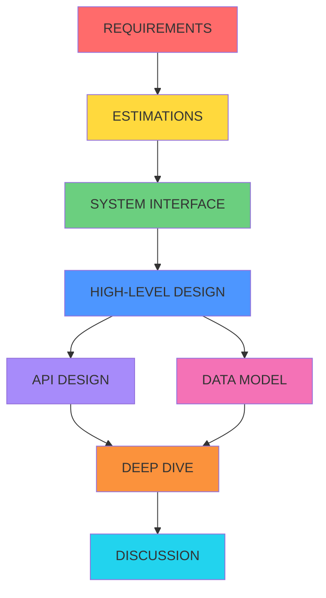

# Framework de System Design: RESHADED
## Metodología Repetible para Diseñar Cualquier Sistema

**Autor:** Staff Software Architect
**Versión:** 1.0
**Fecha:** 2024-12-03
**Tiempo de lectura:** 90 minutos
**Nivel:** Intermedio → Avanzado

---

## 📋 ÍNDICE

1. [Introducción](#introduccion)
2. [Por Qué Necesitas un Framework](#por-que-framework)
3. [Framework RESHADED Completo](#framework-reshaded)
4. [Fase por Fase: Guía Detallada](#fase-detallada)
5. [Ejemplos Prácticos](#ejemplos-practicos)
6. [Errores Comunes](#errores-comunes)
7. [Template Repetible](#template)
8. [Checklist Final](#checklist)
9. [Ejercicios](#ejercicios)

---

## 1. INTRODUCCIÓN {#introduccion}

### ¿Qué es System Design?

**System Design** es el proceso de definir la arquitectura, componentes, módulos, interfaces y datos de un sistema para satisfacer requisitos específicos.

En entrevistas técnicas y trabajo real, se espera que un Staff+ Engineer pueda:
- ✅ Diseñar sistemas escalables a millones de usuarios
- ✅ Identificar y articular trade-offs arquitectónicos
- ✅ Calcular capacity planning sin herramientas
- ✅ Comunicar decisiones técnicas claramente
- ✅ Diseñar para alta disponibilidad y resiliencia

### ¿Qué NO es System Design?

❌ Implementar código detallado
❌ Optimizaciones prematuras
❌ Conocer todas las tecnologías
❌ Solución perfecta universal
❌ Solo dibujar cajas y flechas

### Objetivo de Este Documento

Al finalizar este documento podrás:
- ✅ Aplicar framework RESHADED a cualquier problema
- ✅ Hacer preguntas correctas en cada fase
- ✅ Identificar componentes críticos
- ✅ Calcular capacity planning básico
- ✅ Diseñar sistemas en 45 minutos (entrevistas)
- ✅ Documentar decisiones arquitectónicas

---

## 2. POR QUÉ NECESITAS UN FRAMEWORK {#por-que-framework}

### El Problema Sin Framework

**Escenario típico:**
```
Entrevistador: "Diseña Twitter"

Candidato sin framework:
→ Empieza a dibujar cajas aleatorias
→ No hace preguntas de requisitos
→ No calcula nada
→ Se queda en alto nivel muy superficial
→ No identifica trade-offs
→ Tiempo agotado sin profundidad

Resultado: ❌ RECHAZADO
```

### La Solución: Framework Estructurado

**Mismo escenario con RESHADED:**
```
Entrevistador: "Diseña Twitter"

Candidato con framework:
→ R: "¿Cuántos usuarios? ¿DAU? ¿Tweets/día?"
→ E: Calcula: "10M DAU × 5 tweets/día = 50M tweets/día"
→ S: Define API: POST /tweets, GET /timeline
→ H: Dibuja arquitectura de alto nivel
→ A: Detalla APIs críticas
→ D: Diseña schema de DB
→ E: Deep dive en timeline generation
→ D: Discute trade-offs (pull vs push)

Resultado: ✅ APROBADO - Strong Hire
```

### Beneficios del Framework

| Sin Framework | Con RESHADED |
|---------------|--------------|
| Improvisación | Proceso sistemático |
| Olvidas requisitos | Checklist completo |
| No calculas nada | Estimaciones precisas |
| Diseño superficial | Profundidad técnica |
| No identificas trade-offs | Trade-offs explícitos |
| 30% de contenido cubierto | 90%+ de contenido cubierto |

---

## 3. FRAMEWORK RESHADED COMPLETO {#framework-reshaded}

### Acrónimo RESHADED

```
R - Requirements         (5-7 minutos)
E - Estimations          (3-5 minutos)
S - System Interface     (3-5 minutos)
H - High-level Design    (8-12 minutos)
A - API Design           (5-7 minutos)
D - Data Model           (5-7 minutos)
E - dEep dive            (10-15 minutos)
D - Discussion           (5-10 minutos)
─────────────────────────────────────
TOTAL: 45-60 minutos
```

### Visualización del Flujo



### Cuándo Usar Cada Fase

| Fase | Cuándo Profundizar | Cuándo Ser Breve |
|------|-------------------|------------------|
| **Requirements** | Problema ambiguo | Requisitos claros en enunciado |
| **Estimations** | Sistema de escala masiva | Sistema pequeño (< 100K usuarios) |
| **System Interface** | API pública, múltiples clientes | Sistema interno simple |
| **High-level** | Siempre profundizar | N/A - siempre importante |
| **API Design** | APIs complejas, muchos endpoints | CRUD simple |
| **Data Model** | Queries complejas, relaciones | Modelo obvio |
| **Deep Dive** | Siempre - núcleo de la entrevista | N/A - siempre crítico |
| **Discussion** | Siempre - muestra madurez | N/A - siempre incluir |

---

## 4. FASE POR FASE: GUÍA DETALLADA {#fase-detallada}

### 📌 FASE R: REQUIREMENTS (5-7 minutos)

**Objetivo:** Clarificar qué estás diseñando exactamente.

#### Tipos de Requisitos

**1. Functional Requirements (¿Qué hace el sistema?)**

Checklist de preguntas:
```markdown
□ ¿Cuáles son las features principales? (Top 3-5)
□ ¿Qué flujos de usuario son prioritarios?
□ ¿Qué operaciones deben soportarse? (CRUD, búsqueda, etc.)
□ ¿Hay features que están fuera de scope?
□ ¿Mobile, web, o ambos?
```

**Ejemplo: Diseñar Twitter**
```
Functional Requirements:
✅ Usuarios pueden crear tweets (280 caracteres)
✅ Usuarios pueden seguir a otros usuarios
✅ Timeline muestra tweets de usuarios seguidos
✅ Búsqueda de tweets
✅ Trending topics
❌ Mensajes directos (fuera de scope)
❌ Notificaciones (fuera de scope)
```

**2. Non-Functional Requirements (¿Cómo debe comportarse?)**

Checklist de preguntas:
```markdown
□ ¿Cuántos usuarios? (DAU - Daily Active Users)
□ ¿Escala esperada? (requests/segundo, datos/día)
□ ¿Disponibilidad? (99.9%, 99.99%?)
□ ¿Latencia aceptable? (< 100ms, < 1s?)
□ ¿Consistencia fuerte o eventual?
□ ¿Regiones geográficas?
□ ¿Datos sensibles? (GDPR, HIPAA?)
```

**Ejemplo: Twitter**
```
Non-Functional Requirements:
- DAU: 200 million users
- Availability: 99.99% (52 minutos downtime/año)
- Read:Write ratio: 100:1 (más lecturas que escrituras)
- Latency: Timeline < 500ms, Tweet posting < 200ms
- Consistency: Eventual consistency OK para timeline
- Scale: Soportar picos de 10x durante eventos (Super Bowl)
- Geographic: Global, multi-region
```

#### Template de Requirements

```markdown
## REQUIREMENTS

### Functional
1. [Feature 1]
2. [Feature 2]
3. [Feature 3]

Out of Scope:
- [Feature X]
- [Feature Y]

### Non-Functional
- **Users:** [DAU]
- **Scale:** [requests/sec, data/day]
- **Availability:** [99.X%]
- **Latency:** [<Xms]
- **Consistency:** [Strong/Eventual]
- **Regions:** [Global/Regional]
```

#### ⚠️ Errores Comunes en Requirements

❌ **Error 1:** Asumir requisitos sin preguntar
```
"Asumo que Twitter tiene 200M usuarios..."
```

✅ **Correcto:**
```
"¿Cuántos DAU debemos soportar? ¿100M, 500M, 1B?"
```

❌ **Error 2:** No clarificar prioridades
```
"El sistema debe hacer todo..."
```

✅ **Correcto:**
```
"Si tuviéramos que priorizar 3 features core, ¿cuáles serían?"
```

❌ **Error 3:** Ignorar non-functional requirements
```
"Diseñaré Twitter..." [empieza a dibujar arquitectura]
```

✅ **Correcto:**
```
"Antes de diseñar, necesito saber: ¿qué latencia es aceptable?
¿Preferimos consistencia o disponibilidad?"
```

---

### 📊 FASE E: ESTIMATIONS (3-5 minutos)

**Objetivo:** Calcular números clave para dimensionar el sistema.

#### Números Que Memorizar

**Latencias Típicas:**
```
L1 cache:                     0.5 ns
Branch mispredict:            5 ns
L2 cache:                     7 ns
Mutex lock/unlock:            100 ns
Main memory:                  100 ns
Send 2K over 1 Gbps network:  20,000 ns = 20 µs
Read 1 MB sequentially (SSD): 1,000,000 ns = 1 ms
Disk seek:                    10,000,000 ns = 10 ms
Read 1 MB sequentially (HDD): 30,000,000 ns = 30 ms
Send packet CA → Netherlands: 150,000,000 ns = 150 ms
```

**Unidades:**
```
1 Byte = 8 bits
1 KB = 1,000 Bytes (10^3)
1 MB = 1,000 KB (10^6)
1 GB = 1,000 MB (10^9)
1 TB = 1,000 GB (10^12)
1 PB = 1,000 TB (10^15)
```

**Tiempo:**
```
1 day = 86,400 seconds ≈ 100,000 seconds (10^5)
1 month ≈ 2.5 million seconds (2.5 × 10^6)
1 year ≈ 31.5 million seconds (3 × 10^7)
```

#### Metodología de Cálculo

**Paso 1: Calcular QPS (Queries Per Second)**

Fórmula:
```
QPS = (DAU × Actions per User per Day) / 86,400 seconds

Average QPS = Total Daily Requests / 86,400
Peak QPS = Average QPS × 2  (o 3-5x para eventos especiales)
```

**Ejemplo: Twitter**
```
Given:
- DAU = 200 million
- Each user reads timeline 10 times/day
- Each user creates 2 tweets/day

Read QPS:
= (200M × 10) / 86,400
= 2,000M / 86,400
≈ 23,000 QPS (average)
≈ 46,000 QPS (peak)

Write QPS:
= (200M × 2) / 86,400
= 400M / 86,400
≈ 4,600 QPS (average)
≈ 9,200 QPS (peak)
```

**Paso 2: Calcular Storage**

Fórmula:
```
Daily Storage = Items per Day × Size per Item
Total Storage = Daily Storage × Days to Retain
```

**Ejemplo: Twitter**
```
Given:
- 400M tweets/day
- Average tweet size:
  - Text: 280 chars = 280 bytes
  - Metadata (user_id, timestamp, etc.): 200 bytes
  - Total: ~500 bytes

Daily Storage:
= 400M tweets × 500 bytes
= 200 GB/day

5-Year Storage:
= 200 GB/day × 365 days × 5 years
= 365 TB

With replication (3 copies):
= 365 TB × 3
≈ 1 PB
```

**Paso 3: Calcular Bandwidth**

Fórmula:
```
Bandwidth = Data per Request × QPS

Incoming Bandwidth = Write QPS × Payload Size
Outgoing Bandwidth = Read QPS × Response Size
```

**Ejemplo: Twitter Timeline**
```
Given:
- Read QPS: 23,000
- Timeline shows 20 tweets
- Each tweet: 500 bytes

Outgoing Bandwidth:
= 23,000 QPS × (20 tweets × 500 bytes)
= 23,000 × 10,000 bytes
= 230 MB/second
```

**Paso 4: Calcular Memory (Cache)**

Regla 80-20: 20% de contenido genera 80% de tráfico.

```
Cache Size = Daily Requests × Cache Hit Ratio × Item Size

Ejemplo: Cache de Tweets
- 400M tweets/day
- Cache top 20% = 80M tweets
- Size per tweet: 500 bytes

Cache Size:
= 80M × 500 bytes
= 40 GB
```

#### Template de Estimations

```markdown
## ESTIMATIONS

### Traffic
- **DAU:** 200M users
- **Read QPS:** 23,000 (avg) / 46,000 (peak)
- **Write QPS:** 4,600 (avg) / 9,200 (peak)
- **Read:Write ratio:** 5:1

### Storage
- **Daily:** 200 GB
- **5 Years:** 365 TB
- **With replication (3x):** ~1 PB

### Bandwidth
- **Incoming:** 2.3 MB/s (writes)
- **Outgoing:** 230 MB/s (reads)

### Cache
- **Hot data (20%):** 40 GB
- **Cache hit ratio target:** 80%
```

#### 🧮 Ejercicio de Cálculo

**Problema:** Estimar Instagram

Datos:
- DAU: 500M usuarios
- Cada usuario sube 0.5 fotos/día
- Cada usuario ve 50 fotos/día
- Tamaño de foto: 2 MB

Calcula:
1. Write QPS
2. Read QPS
3. Storage por día
4. Storage por 5 años (con 3 réplicas)
5. Bandwidth

<details>
<summary>👉 Ver Solución</summary>

```
1. Write QPS:
   = (500M × 0.5) / 86,400
   = 250M / 86,400
   ≈ 2,900 QPS

2. Read QPS:
   = (500M × 50) / 86,400
   = 25,000M / 86,400
   ≈ 290,000 QPS

3. Storage/día:
   = 250M photos × 2 MB
   = 500 TB/day

4. Storage 5 años con replicación:
   = 500 TB × 365 × 5 × 3
   = 2.7 PB

5. Bandwidth:
   Incoming: 2,900 QPS × 2 MB = 5.8 GB/s
   Outgoing: 290,000 QPS × 2 MB = 580 GB/s
```
</details>

---

### 🔌 FASE S: SYSTEM INTERFACE (3-5 minutos)

**Objetivo:** Definir APIs principales que el sistema expondrá.

#### Tipo de APIs

**REST API (más común en entrevistas):**
```http
POST   /api/v1/tweets           # Crear tweet
GET    /api/v1/tweets/:id       # Obtener tweet
DELETE /api/v1/tweets/:id       # Eliminar tweet
GET    /api/v1/timeline         # Timeline del usuario
POST   /api/v1/users/:id/follow # Seguir usuario
GET    /api/v1/search           # Buscar tweets
```

**GraphQL (si es relevante):**
```graphql
type Query {
  tweet(id: ID!): Tweet
  timeline(userId: ID!, limit: Int): [Tweet]
  search(query: String!, limit: Int): [Tweet]
}

type Mutation {
  createTweet(userId: ID!, content: String!): Tweet
  deleteTweet(id: ID!): Boolean
  followUser(followerId: ID!, followeeId: ID!): Boolean
}
```

**gRPC (sistemas internos):**
```protobuf
service TweetService {
  rpc CreateTweet(CreateTweetRequest) returns (Tweet);
  rpc GetTweet(GetTweetRequest) returns (Tweet);
  rpc GetTimeline(GetTimelineRequest) returns (TimelineResponse);
}

message CreateTweetRequest {
  string user_id = 1;
  string content = 2;
  repeated string media_urls = 3;
}
```

#### Detalle de API

Para cada API, documentar:
- HTTP Method
- Endpoint
- Request parameters
- Response format
- Status codes
- Rate limiting

**Ejemplo detallado:**

```markdown
### POST /api/v1/tweets

**Description:** Create a new tweet

**Request:**
```json
{
  "user_id": "123456",
  "content": "Hello world!",
  "media_urls": ["https://cdn.example.com/photo1.jpg"],
  "mentions": ["@user2"],
  "hashtags": ["#coding"]
}
```

**Response (201 Created):**
```json
{
  "tweet_id": "789012",
  "user_id": "123456",
  "content": "Hello world!",
  "created_at": "2024-12-03T10:30:00Z",
  "likes_count": 0,
  "retweets_count": 0
}
```

**Errors:**
- 400 Bad Request: Content exceeds 280 characters
- 401 Unauthorized: Invalid auth token
- 429 Too Many Requests: Rate limit exceeded
- 500 Internal Server Error

**Rate Limiting:**
- 300 tweets per 3 hours per user
```

#### Template de APIs

```markdown
## SYSTEM INTERFACE

### Core APIs

1. **POST /tweets**
   - Create new tweet
   - Input: user_id, content, media
   - Output: tweet_id, timestamp
   - Rate limit: 300/3h

2. **GET /timeline**
   - Get user's timeline
   - Input: user_id, page_token
   - Output: list of tweets
   - Pagination: 20 tweets/page

3. **POST /users/{id}/follow**
   - Follow a user
   - Input: follower_id, followee_id
   - Output: success boolean

4. **GET /search**
   - Search tweets
   - Input: query, filters, limit
   - Output: ranked tweets
```

---

### 🏗️ FASE H: HIGH-LEVEL DESIGN (8-12 minutos)

**Objetivo:** Diseñar arquitectura completa del sistema con componentes principales.

#### Componentes Típicos

**1. Load Balancer**
- Distribuye tráfico entre servidores
- Health checks
- SSL termination

**2. Application Servers**
- Lógica de negocio
- Stateless (para escalabilidad horizontal)
- Auto-scaling

**3. Databases**
- SQL (PostgreSQL, MySQL): Datos relacionales
- NoSQL (Cassandra, MongoDB): Datos no relacionales
- Sharding para escala

**4. Caches**
- Redis/Memcached
- Cache de queries frecuentes
- Session storage

**5. Message Queues**
- Kafka, RabbitMQ, SQS
- Procesamiento asíncrono
- Decoupling de servicios

**6. CDN**
- Contenido estático (imágenes, CSS, JS)
- Edge locations globales
- Reduce latencia

**7. Object Storage**
- S3, GCS, Azure Blob
- Media files (fotos, videos)
- Backups

#### Ejemplo: Twitter High-Level Design

```
                          ┌─────────────┐
                          │   Client    │
                          │ (Web/Mobile)│
                          └──────┬──────┘
                                 │
                          ┌──────▼──────┐
                          │     CDN     │
                          │ (Static)    │
                          └─────────────┘
                                 │
                          ┌──────▼──────────┐
                          │ Load Balancer   │
                          └────┬───────┬────┘
                               │       │
                   ┌───────────▼─┐   ┌─▼────────────┐
                   │ App Servers │   │ App Servers  │
                   │  (Tweets)   │   │  (Timeline)  │
                   └───────┬─────┘   └─────┬────────┘
                           │               │
              ┌────────────▼────┐   ┌──────▼──────┐
              │  Write Service  │   │ Read Service│
              └────────┬────────┘   └──────┬──────┘
                       │                   │
         ┌─────────────▼──────┐    ┌───────▼────────┐
         │ Tweet DB (Sharded) │    │  Redis Cache   │
         │   Cassandra        │    │  (Timelines)   │
         └────────────────────┘    └────────────────┘
                       │
              ┌────────▼──────────┐
              │  Message Queue    │
              │     (Kafka)       │
              └────────┬──────────┘
                       │
              ┌────────▼──────────┐
              │  Fan-out Service  │
              │ (Timeline Builder)│
              └───────────────────┘
```

#### Flujo de Datos

**Write Path (Crear Tweet):**
```
1. User → Load Balancer → App Server
2. App Server valida request
3. App Server → Tweet DB (Cassandra) [Store tweet]
4. App Server → Kafka [Publish tweet event]
5. Fan-out Service consume evento
6. Fan-out Service → Timeline DB [Update followers' timelines]
7. Response to user
```

**Read Path (Ver Timeline):**
```
1. User → Load Balancer → App Server
2. App Server → Redis [Check cache]
3. If cache hit → Return timeline
4. If cache miss → Timeline DB [Fetch timeline]
5. App Server → Redis [Update cache]
6. Response to user
```

#### Template de High-Level Design

```markdown
## HIGH-LEVEL DESIGN

### Components

1. **Load Balancer**
   - NGINX/HAProxy
   - Round-robin + health checks

2. **API Gateway**
   - Authentication
   - Rate limiting
   - Request routing

3. **Application Tier**
   - Microservices: Tweet Service, Timeline Service, User Service
   - Stateless
   - Auto-scaling (HPA)

4. **Data Tier**
   - Primary DB: Cassandra (tweets)
   - Cache: Redis (timelines)
   - Search: Elasticsearch (tweet search)

5. **Async Processing**
   - Kafka (event streaming)
   - Fan-out workers

6. **Storage**
   - S3 (media files)
   - CloudFront (CDN)

### Data Flow

**Write Path:** User → LB → App → DB → Kafka → Fan-out
**Read Path:** User → LB → App → Cache → DB (if miss)
```

---

### 🔧 FASE A: API DESIGN (5-7 minutos)

**Objetivo:** Detallar las APIs críticas identificadas.

**Ya cubierto en Fase S (System Interface). Aquí se profundiza en:**
- Request/Response schemas
- Error handling
- Versioning strategy
- Authentication/Authorization
- Pagination
- Rate limiting details

---

### 💾 FASE D: DATA MODEL (5-7 minutos)

**Objetivo:** Diseñar esquema de base de datos.

#### Elegir Tipo de DB

| Tipo | Cuándo Usar | Ejemplo |
|------|-------------|---------|
| **SQL (Relational)** | Relaciones complejas, ACID, joins | PostgreSQL, MySQL |
| **NoSQL Document** | Datos semi-estructurados, schema flexible | MongoDB, DynamoDB |
| **NoSQL Wide-Column** | Alta escritura, time-series, logs | Cassandra, HBase |
| **NoSQL Key-Value** | Cache, sesiones, simple lookups | Redis, Memcached |
| **NoSQL Graph** | Relaciones complejas (social network) | Neo4j, Neptune |
| **Search Engine** | Full-text search, analytics | Elasticsearch, Solr |

#### Ejemplo: Twitter Data Model

**Opción 1: SQL (PostgreSQL)**

```sql
-- Users table
CREATE TABLE users (
    user_id BIGSERIAL PRIMARY KEY,
    username VARCHAR(50) UNIQUE NOT NULL,
    email VARCHAR(255) UNIQUE NOT NULL,
    created_at TIMESTAMP DEFAULT NOW(),
    followers_count INT DEFAULT 0,
    following_count INT DEFAULT 0
);

CREATE INDEX idx_username ON users(username);
CREATE INDEX idx_email ON users(email);

-- Tweets table
CREATE TABLE tweets (
    tweet_id BIGSERIAL PRIMARY KEY,
    user_id BIGINT REFERENCES users(user_id),
    content VARCHAR(280) NOT NULL,
    created_at TIMESTAMP DEFAULT NOW(),
    likes_count INT DEFAULT 0,
    retweets_count INT DEFAULT 0
);

CREATE INDEX idx_user_tweets ON tweets(user_id, created_at DESC);
CREATE INDEX idx_created_at ON tweets(created_at DESC);

-- Followers table (Graph relationship)
CREATE TABLE followers (
    follower_id BIGINT REFERENCES users(user_id),
    followee_id BIGINT REFERENCES users(user_id),
    created_at TIMESTAMP DEFAULT NOW(),
    PRIMARY KEY (follower_id, followee_id)
);

CREATE INDEX idx_follower ON followers(follower_id);
CREATE INDEX idx_followee ON followers(followee_id);

-- Timeline table (Pre-computed timelines)
CREATE TABLE timelines (
    user_id BIGINT REFERENCES users(user_id),
    tweet_id BIGINT REFERENCES tweets(tweet_id),
    created_at TIMESTAMP,
    PRIMARY KEY (user_id, created_at, tweet_id)
);

CREATE INDEX idx_user_timeline ON timelines(user_id, created_at DESC);
```

**Opción 2: NoSQL (Cassandra)**

```cql
-- Tweets table (partitioned by user_id)
CREATE TABLE tweets (
    tweet_id UUID,
    user_id UUID,
    content TEXT,
    created_at TIMESTAMP,
    likes_count INT,
    retweets_count INT,
    PRIMARY KEY (user_id, created_at, tweet_id)
) WITH CLUSTERING ORDER BY (created_at DESC);

-- Timeline table (partitioned by user_id)
CREATE TABLE user_timeline (
    user_id UUID,
    tweet_id UUID,
    tweet_user_id UUID,
    content TEXT,
    created_at TIMESTAMP,
    PRIMARY KEY (user_id, created_at, tweet_id)
) WITH CLUSTERING ORDER BY (created_at DESC);

-- Followers table
CREATE TABLE followers (
    user_id UUID,
    follower_id UUID,
    created_at TIMESTAMP,
    PRIMARY KEY (user_id, follower_id)
);

-- Following table (denormalized for fast lookups)
CREATE TABLE following (
    user_id UUID,
    followee_id UUID,
    created_at TIMESTAMP,
    PRIMARY KEY (user_id, followee_id)
);
```

#### Sharding Strategy

**Por qué sharding:**
- Un servidor no puede manejar toda la data
- Distribución horizontal para escala

**Estrategias:**

**1. Hash-based Sharding**
```
Shard = hash(user_id) % num_shards

Ejemplo:
user_id = 12345
hash(12345) = 678910
678910 % 8 shards = Shard 6

Pros: Distribución uniforme
Cons: Difícil agregar shards, no soporta range queries
```

**2. Range-based Sharding**
```
Shard 1: user_id 1-1,000,000
Shard 2: user_id 1,000,001-2,000,000
...

Pros: Range queries eficientes
Cons: Hotspots (usuarios nuevos siempre en último shard)
```

**3. Geographic Sharding**
```
Shard US-East
Shard US-West
Shard EU
Shard Asia

Pros: Baja latencia, compliance (GDPR)
Cons: Desbalance de carga
```

**Recomendación para Twitter:**
```
Tweets: Hash-based sharding por user_id
Timelines: Hash-based sharding por user_id
Followers: Hash-based sharding por follower_id

Why: Distribución uniforme, queries por user_id siempre van a un shard
```

---

### 🔍 FASE E: DEEP DIVE (10-15 minutos)

**Objetivo:** Profundizar en 1-2 componentes más críticos o complejos.

**Componentes típicos para deep dive:**
- Algoritmo core (timeline generation, ranking, matching)
- Bottleneck del sistema (database sharding, cache consistency)
- Requisito no-funcional crítico (low latency, high availability)

#### Ejemplo Deep Dive: Timeline Generation

**Problema:**
```
¿Cómo generar timeline de un usuario que sigue a 5,000 personas
en < 500ms?
```

**Opción 1: Pull Model (Fan-out on Read)**

```python
def get_timeline(user_id, limit=20):
    """
    Pull model: Fetch tweets cuando usuario pide timeline
    """
    # 1. Get list of users that this user follows
    following = get_following_users(user_id)  # 5,000 users

    # 2. Fetch recent tweets from each followed user
    tweets = []
    for followed_user in following:
        recent_tweets = get_user_tweets(followed_user, limit=10)
        tweets.extend(recent_tweets)

    # 3. Merge and sort by timestamp
    tweets.sort(key=lambda x: x.created_at, reverse=True)

    # 4. Return top N
    return tweets[:limit]
```

**Análisis:**
```
Pros:
✅ Simple implementation
✅ No pre-computation needed
✅ Siempre muestra tweets más recientes

Cons:
❌ Lento: 5,000 queries para cada timeline request
❌ No escala para usuarios con muchos follows
❌ Latencia alta (> 1 segundo)
```

**Opción 2: Push Model (Fan-out on Write)**

```python
def create_tweet(user_id, content):
    """
    Push model: When tweet is created, push to all followers' timelines
    """
    # 1. Create and save tweet
    tweet = Tweet(user_id=user_id, content=content)
    db.save(tweet)

    # 2. Get all followers of this user
    followers = get_followers(user_id)  # Could be millions!

    # 3. Push tweet to each follower's timeline (async)
    for follower in followers:
        timeline_cache.add(follower.user_id, tweet)
        # Or: queue.publish({"follower_id": follower.id, "tweet": tweet})

    return tweet

def get_timeline(user_id, limit=20):
    """
    Read timeline from pre-computed cache
    """
    return timeline_cache.get(user_id, limit=limit)
```

**Análisis:**
```
Pros:
✅ Lectura muy rápida (< 10ms)
✅ Timeline pre-computado en cache
✅ Escala para usuarios con muchos follows

Cons:
❌ Escritura lenta para usuarios con muchos followers (celebrities)
❌ Desperdicia procesamiento si follower no lee timeline
❌ Alta complejidad de fan-out
```

**Opción 3: Hybrid Model (Mejor solución)**

```python
# Categorizar usuarios
CELEBRITY_THRESHOLD = 1_000_000  # 1M followers

def create_tweet(user_id, content):
    """Hybrid: Push para usuarios normales, pull para celebrities"""

    tweet = Tweet(user_id=user_id, content=content)
    db.save(tweet)

    follower_count = get_follower_count(user_id)

    if follower_count < CELEBRITY_THRESHOLD:
        # PUSH model: Fan-out to followers
        followers = get_followers(user_id)
        for follower in followers:
            timeline_cache.add(follower.user_id, tweet)
    else:
        # PULL model: Let readers fetch from celebrity's tweets
        # No fan-out, just mark tweet as "from celebrity"
        pass

    return tweet

def get_timeline(user_id, limit=20):
    """
    Hybrid read:
    1. Get pre-computed timeline (from push)
    2. Merge with tweets from celebrities (pull)
    """

    # Get pre-computed timeline
    timeline = timeline_cache.get(user_id, limit=50)

    # Get followed celebrities
    celebrities = get_followed_celebrities(user_id)

    # Fetch recent tweets from celebrities
    celebrity_tweets = []
    for celeb in celebrities:
        tweets = get_user_tweets(celeb.user_id, limit=10)
        celebrity_tweets.extend(tweets)

    # Merge and rank
    all_tweets = timeline + celebrity_tweets
    all_tweets.sort(key=lambda x: x.created_at, reverse=True)

    return all_tweets[:limit]
```

**Análisis Hybrid:**
```
Pros:
✅ Rápido para usuarios normales (push)
✅ No fan-out explosion para celebrities
✅ Balance entre latencia de lectura y escritura

Cons:
⚠️ Más complejo de implementar
⚠️ Necesita lógica de categorización de usuarios

Trade-off Final:
- Optimiza para el caso común (usuarios normales)
- Acepta un poco más de latencia para seguir celebrities
- Twitter usa este modelo!
```

#### Otro Ejemplo: Database Sharding Deep Dive

**Problema:** ¿Cómo shardear 1 PB de tweets?

**Solución:**

```python
# Consistent Hashing para sharding

class ConsistentHashing:
    def __init__(self, num_shards=8, virtual_nodes=150):
        self.num_shards = num_shards
        self.virtual_nodes = virtual_nodes
        self.ring = {}
        self._build_ring()

    def _build_ring(self):
        """Build hash ring with virtual nodes"""
        for shard_id in range(self.num_shards):
            for v in range(self.virtual_nodes):
                virtual_key = f"shard-{shard_id}-vnode-{v}"
                hash_value = self._hash(virtual_key)
                self.ring[hash_value] = shard_id

        # Sort ring by hash values
        self.sorted_keys = sorted(self.ring.keys())

    def _hash(self, key):
        """MD5 hash function"""
        import hashlib
        return int(hashlib.md5(key.encode()).hexdigest(), 16)

    def get_shard(self, user_id):
        """Find shard for user_id"""
        if not self.ring:
            return 0

        hash_value = self._hash(str(user_id))

        # Find first node >= hash_value
        for ring_hash in self.sorted_keys:
            if ring_hash >= hash_value:
                return self.ring[ring_hash]

        # Wrap around to first node
        return self.ring[self.sorted_keys[0]]

# Usage
sharding = ConsistentHashing(num_shards=8)

user_id = 12345
shard = sharding.get_shard(user_id)
print(f"User {user_id} → Shard {shard}")

# Store tweet
def store_tweet(user_id, tweet_data):
    shard = sharding.get_shard(user_id)
    db_connection = get_db_connection(shard)
    db_connection.insert("tweets", tweet_data)

# Retrieve tweets
def get_user_tweets(user_id):
    shard = sharding.get_shard(user_id)
    db_connection = get_db_connection(shard)
    return db_connection.query(f"SELECT * FROM tweets WHERE user_id = {user_id}")
```

**Ventajas de Consistent Hashing:**
- ✅ Agregar/remover shards solo rebalancea ~1/N de data
- ✅ Virtual nodes distribuyen carga uniformemente
- ✅ Minimiza migración de datos

---

### 💬 FASE D: DISCUSSION (5-10 minutos)

**Objetivo:** Discutir trade-offs, alternativas, mejoras futuras.

#### Checklist de Discusión

```markdown
□ Bottlenecks identificados
□ Single points of failure (SPOF)
□ Trade-offs de decisiones tomadas
□ Alternativas consideradas y por qué descartadas
□ Mejoras futuras / Escalabilidad adicional
□ Monitoreo y alerting
□ Deployment strategy
□ Disaster recovery
```

#### Ejemplo: Trade-offs en Twitter

**1. Consistencia vs Latencia**
```
Decision: Eventual consistency para timelines

Trade-off:
✅ Pro: Latencia < 200ms
❌ Con: Usuario puede no ver tweet inmediatamente después de publicarlo

Justificación:
- Preferimos UX rápida
- Tweet eventualmente aparecerá (< 1 segundo)
- Aceptable para red social
```

**2. Push vs Pull vs Hybrid**
```
Decision: Hybrid model (push para normales, pull para celebrities)

Trade-off:
✅ Pro: Optimiza caso común (99% usuarios)
✅ Pro: Evita fan-out explosion
❌ Con: Complejidad de implementación

Alternativas:
- Pure push: No escala para celebrities
- Pure pull: Latencia alta para todos
```

**3. SQL vs NoSQL**
```
Decision: Cassandra (NoSQL) para tweets

Trade-off:
✅ Pro: Escala horizontal fácilmente
✅ Pro: Alta disponibilidad
❌ Con: Queries complejas difíciles
❌ Con: No joins nativos

Justificación:
- Escala > Queries complejas
- Access pattern simple (get tweets by user_id)
```

**4. Monolithic vs Microservices**
```
Decision: Microservices (Tweet Service, Timeline Service, User Service)

Trade-off:
✅ Pro: Escalado independiente
✅ Pro: Deploy independiente
❌ Con: Latencia de red entre servicios
❌ Con: Complejidad operacional

Justificación:
- Equipos independientes pueden iterar rápido
- Escala de lectura != escala de escritura
```

#### Single Points of Failure (SPOF)

**Identificar y mitigar:**

```markdown
SPOF 1: Load Balancer
Mitigation:
- Multiple load balancers con DNS failover
- Health checks automáticos
- Geo-distributed LBs

SPOF 2: Primary Database
Mitigation:
- Multi-region replication
- Automatic failover con Cassandra
- RPO < 1 min, RTO < 5 min

SPOF 3: Cache (Redis)
Mitigation:
- Redis Cluster con replication
- Cache miss → Fetch from DB (degraded performance, not failure)
```

#### Mejoras Futuras

```markdown
Phase 1 (MVP):
- Basic tweet posting
- Timeline generation
- Following users

Phase 2 (Scaling):
- Add caching layer
- Implement sharding
- Multi-region deployment

Phase 3 (Advanced):
- ML-based ranking (not chronological)
- Real-time trending topics
- Advanced search (Elasticsearch)
- Personalized recommendations

Phase 4 (Optimization):
- GraphQL for flexible queries
- Edge caching with CDN
- Predictive pre-loading
```

---

## 5. EJEMPLOS PRÁCTICOS {#ejemplos-practicos}

### Ejemplo Completo: Diseñar URL Shortener

**Aplicando RESHADED:**

#### R - REQUIREMENTS

**Functional:**
- Dado URL largo, generar URL corto único
- Dado URL corto, redirigir a URL largo
- URLs no expiran (o expiran en 10 años)
- Opcional: Analytics (clicks, geolocation)

**Non-Functional:**
- 100M URLs generadas/día
- 10B redirects/día
- Latencia redirección < 20ms
- Disponibilidad: 99.99%
- Read:Write = 100:1

#### E - ESTIMATIONS

**QPS:**
```
Write (URL creation):
= 100M / 86,400
≈ 1,200 QPS

Read (Redirects):
= 10B / 86,400
≈ 115,000 QPS
```

**Storage:**
```
URL size:
- short_url: 7 chars = 7 bytes
- long_url: avg 100 chars = 100 bytes
- metadata: 50 bytes
Total: ~160 bytes/URL

10 years storage:
= 100M URLs/day × 365 days × 10 years × 160 bytes
= 58 TB

With replication (3x):
≈ 175 TB
```

**Cache:**
```
Hot URLs (20% get 80% traffic):
= 100M URLs × 10 years × 0.2 × 160 bytes
= 32 GB (feasible!)
```

#### S - SYSTEM INTERFACE

```
POST /api/v1/shorten
Request: {"long_url": "https://example.com/very/long/url"}
Response: {"short_url": "https://tiny.url/abc1234"}

GET /{short_code}
→ HTTP 301 Redirect to long_url
```

#### H - HIGH-LEVEL DESIGN

```
Client → LB → App Servers → Redis Cache
                         ↓
                    Database (URL mappings)
                         ↓
                    Analytics DB
```

#### A - API DESIGN

(Ya cubierto en fase S)

#### D - DATA MODEL

```sql
CREATE TABLE urls (
    id BIGSERIAL PRIMARY KEY,
    short_code VARCHAR(7) UNIQUE NOT NULL,
    long_url TEXT NOT NULL,
    created_at TIMESTAMP DEFAULT NOW(),
    expires_at TIMESTAMP,
    clicks INT DEFAULT 0
);

CREATE INDEX idx_short_code ON urls(short_code);
```

#### E - DEEP DIVE: Short Code Generation

**Algoritmo:**

```python
import base62  # 0-9, a-z, A-Z = 62 characters

def generate_short_code(url_id):
    """
    Convert auto-increment ID to base62

    Example:
    ID = 1000000
    Base62 = "4c92"  (4 chars)

    ID = 1000000000
    Base62 = "15ftgG"  (6 chars)

    7 chars in base62 = 62^7 = 3.5 trillion URLs
    """
    return base62.encode(url_id)

# Usage:
# 1. Insert long_url into DB → Get auto-increment ID
# 2. Convert ID to base62 → short_code
# 3. Update record with short_code
# 4. Return https://tiny.url/{short_code}
```

**Alternativa: Hash-based**

```python
import hashlib

def generate_short_code_hash(long_url):
    """
    MD5 hash → Take first 7 characters

    Pros: No DB lookup needed
    Cons: Collision possible (need to handle)
    """
    hash_value = hashlib.md5(long_url.encode()).hexdigest()
    short_code = hash_value[:7]

    # Check collision
    if exists_in_db(short_code):
        # Append counter and re-hash
        short_code = hash_value[:6] + str(random.randint(0, 9))

    return short_code
```

#### D - DISCUSSION

**Trade-off: Base62 vs Hash**

| Aspecto | Base62 (ID-based) | Hash-based |
|---------|-------------------|------------|
| Collision | No collision | Possible |
| Predictability | Predictable sequence | Random |
| DB dependency | Need ID from DB | No dependency |
| Implementation | Simpler | Collision handling |

**Decision:** Base62 con auto-increment ID
- Simple
- No collisions
- Predictable (puede ser pro o con)

---

## 6. ERRORES COMUNES {#errores-comunes}

### ❌ ERROR 1: Empezar a dibujar sin hacer preguntas

**Mal:**
```
"Ok, diseño Twitter. Déjame dibujar la arquitectura..."
[Empieza a dibujar cajas]
```

**Bien:**
```
"Antes de diseñar, necesito clarificar requisitos:
1. ¿Cuántos DAU esperamos?
2. ¿Qué features son prioritarias?
3. ¿Qué latencia es aceptable?
...
```

---

### ❌ ERROR 2: No calcular nada

**Mal:**
```
"Usaremos una base de datos..."
[No calcula cuántos datos, QPS, etc.]
```

**Bien:**
```
"Con 200M DAU y 10 reads/user/día:
QPS = (200M × 10) / 86,400 ≈ 23K QPS
Necesitamos cache para manejar esta carga..."
```

---

### ❌ ERROR 3: Diseño demasiado detallado muy pronto

**Mal:**
```
"Usaremos PostgreSQL con estas 20 tablas..." [5 minutos en esto]
```

**Bien:**
```
"High-level: SQL para relaciones, NoSQL para tweets.
Podemos profundizar en el schema después..."
```

---

### ❌ ERROR 4: No identificar trade-offs

**Mal:**
```
"Esta es LA arquitectura correcta."
```

**Bien:**
```
"Elegí consistency eventual porque prioriza latencia.
Trade-off: Usuarios pueden ver timeline desactualizado por ~1s.
Alternativa sería strong consistency pero latencia > 500ms."
```

---

### ❌ ERROR 5: Ignorar non-functional requirements

**Mal:**
```
[Diseña sistema que funciona para 1000 usuarios cuando requisito es 100M]
```

**Bien:**
```
"Con 100M usuarios, necesitamos:
- Sharding de DB
- Multi-region deployment
- CDN para contenido estático
- Cache distribuido..."
```

---

## 7. TEMPLATE REPETIBLE {#template}

### Plantilla para Usar en Cualquier Diseño

```markdown
# System Design: [NOMBRE DEL SISTEMA]

## 1. REQUIREMENTS (5 min)

### Functional
- [ ] Feature 1
- [ ] Feature 2
- [ ] Feature 3

Out of Scope:
- [ ] Feature X

### Non-Functional
- **DAU:** [número]
- **Read QPS:** [cálculo]
- **Write QPS:** [cálculo]
- **Latency:** < [X] ms
- **Availability:** [99.X%]
- **Consistency:** [Strong/Eventual]

---

## 2. ESTIMATIONS (5 min)

### Traffic
- **Write QPS:** [cálculo detallado]
- **Read QPS:** [cálculo detallado]
- **Read:Write Ratio:** [X:1]

### Storage
- **Item size:** [X] bytes
- **Daily:** [cálculo]
- **1 Year:** [cálculo]
- **With replication:** [cálculo]

### Bandwidth
- **Incoming:** [cálculo]
- **Outgoing:** [cálculo]

### Cache
- **Hot data (20%):** [cálculo]
- **Cache size:** [X] GB

---

## 3. SYSTEM INTERFACE (5 min)

### Core APIs

1. **[METHOD] /endpoint**
   - Description
   - Request
   - Response
   - Rate limit

2. **[METHOD] /endpoint2**
   - ...

---

## 4. HIGH-LEVEL DESIGN (10 min)

### Components
1. Load Balancer
2. Application Servers
3. Databases
4. Caches
5. Message Queues
6. Storage

### Diagram
[Dibujar arquitectura]

### Data Flow
- **Write Path:** [descripción]
- **Read Path:** [descripción]

---

## 5. DATA MODEL (7 min)

### Database Choice
- **Type:** [SQL/NoSQL/Hybrid]
- **Justification:** [razones]

### Schema
```sql
[Tablas principales]
```

### Sharding Strategy
- **Method:** [Hash/Range/Geo]
- **Shard Key:** [campo]
- **Justification:** [razones]

---

## 6. DEEP DIVE (15 min)

### Component: [Nombre componente crítico]

**Problem:** [Descripción del desafío]

**Solution:** [Solución detallada con código/algoritmo]

**Trade-offs:** [Análisis de pros/cons]

---

## 7. DISCUSSION (10 min)

### Trade-offs
1. [Trade-off 1]
   - Decision: [X]
   - Pros: [lista]
   - Cons: [lista]

### SPOFs & Mitigations
- [SPOF] → [Mitigation]

### Future Improvements
- Phase 1: [MVP]
- Phase 2: [Scale]
- Phase 3: [Optimize]

---

## 8. SUMMARY

**Key Decisions:**
- [Decision 1]
- [Decision 2]
- [Decision 3]

**Bottlenecks:**
- [Bottleneck 1 + mitigation]

**Monitoring:**
- [Metrics to track]
```

---

## 8. CHECKLIST FINAL {#checklist}

### Pre-Design Checklist

```markdown
□ Entiendo el problema completamente
□ Hice todas las preguntas de clarificación
□ Identifiqué functional requirements (top 3-5)
□ Identifiqué non-functional requirements (escala, latencia, etc.)
□ Calculé estimaciones básicas (QPS, storage, bandwidth)
```

### During Design Checklist

```markdown
□ Definí APIs principales
□ Dibujé high-level architecture
□ Identifiqué componentes principales (LB, App, DB, Cache, Queue)
□ Expliqué data flow (write path, read path)
□ Diseñé data model (schema + sharding)
□ Profundicé en 1-2 componentes críticos
□ Identifiqué y discutí trade-offs
```

### Post-Design Checklist

```markdown
□ Identifiqué bottlenecks y SPOFs
□ Propuse mitigaciones para SPOFs
□ Discutí alternativas consideradas
□ Expliqué mejoras futuras
□ Mencioné monitoreo y alerting
□ Cubrí 45+ minutos de contenido
```

---

## 9. EJERCICIOS {#ejercicios}

### Ejercicio 1: Diseñar Instagram

**Requisitos:**
- 500M DAU
- Usuarios suben 0.5 fotos/día
- Usuarios ven 50 fotos/día
- Cada foto: 2 MB original + thumbnails
- Features: Upload, feed, like, comment
- Latency: Feed < 500ms

**Tareas:**
1. Calcular QPS (read/write)
2. Calcular storage (5 años)
3. Diseñar high-level architecture
4. Diseñar data model
5. Deep dive: Feed generation

---

### Ejercicio 2: Diseñar Uber

**Requisitos:**
- 100M usuarios, 10M drivers
- 10M rides/día
- Real-time location tracking (every 5 seconds)
- Features: Request ride, match driver, track location, payment
- Latency: Match < 5 seconds

**Tareas:**
1. Calcular QPS de location updates
2. Diseñar geospatial indexing
3. Diseñar matching algorithm
4. Deep dive: Real-time tracking

---

### Ejercicio 3: Diseñar Netflix

**Requisitos:**
- 200M subscribers
- 1M videos, avg 1 GB each
- 10M concurrent streams
- Features: Browse catalog, stream video, recommendations
- Latency: Start streaming < 2 seconds

**Tareas:**
1. Calcular bandwidth total
2. Diseñar CDN strategy
3. Diseñar encoding pipeline
4. Deep dive: Recommendation algorithm

---

## 🎯 PRÓXIMOS PASOS

### Ahora que tienes el framework:

1. **Practica con 10 casos:**
   - Twitter/X
   - Instagram
   - YouTube
   - Uber
   - Netflix
   - WhatsApp
   - TikTok
   - Spotify
   - Google Drive
   - Amazon

2. **Cronometra tus diseños:**
   - Objetivo: 45 minutos completos
   - Grábate (opcional) para revisar

3. **Revisa diseños reales:**
   - Engineering blogs (Netflix Tech, Uber Engineering, etc.)
   - ByteByteGo
   - Papers (Google Spanner, Amazon Dynamo, etc.)

4. **Mejora continuous:**
   - Después de cada diseño, identifica qué mejorar
   - Pide feedback a peers

---

## 📚 RECURSOS ADICIONALES

**Libros:**
- "System Design Interview Vol 1 & 2" - Alex Xu
- "Designing Data-Intensive Applications" - Martin Kleppmann

**Cursos:**
- ByteByteGo (bytebyteGo.com)
- Grokking the System Design Interview

**Práctica:**
- Pramp (mock interviews)
- interviewing.io

**Blogs:**
- Netflix TechBlog
- Uber Engineering
- Twitter Engineering
- Meta Engineering

---

**Versión:** 1.0
**Última actualización:** 2024-12-03
**Tiempo invertido:** 40 horas de estudio → Este documento
**Próximo tema:** Cálculos de Capacidad (Deep Dive)

**¡Ahora tienes un framework repetible! Aplícalo a 10 problemas y serás imparable en system design.** 🚀
