# Plan de Integración de IA en Proyectos de Software
## Perspectiva: Arquitecto de Software Experto en IA

**Versión:** 1.0
**Fecha:** 2024-12-03
**Audiencia:** Arquitectos de Software, Tech Leads, Engineering Managers

---

## 📋 Índice

1. [Estrategia de Integración](#estrategia)
2. [Arquitecturas de Referencia](#arquitecturas)
3. [Buenas Prácticas](#buenas-practicas)
4. [Errores Críticos que Evitar](#errores-criticos)
5. [Stack Tecnológico Recomendado](#stack-tecnologico)
6. [Evaluación y Métricas](#evaluacion)
7. [Casos de Uso Prioritarios](#casos-uso)
8. [Roadmap de Implementación](#roadmap)

---

## 1. ESTRATEGIA DE INTEGRACIÓN {#estrategia}

### 1.1 AI-First vs AI-Enhanced

```mermaid
graph TD
    A[Proyecto Nuevo] --> B{¿IA es core del negocio?}
    B -->|Sí| C[AI-First Architecture]
    B -->|No| D[AI-Enhanced Architecture]

    C --> E[LLM Gateway Central]
    C --> F[Agentic Systems]
    C --> G[Streaming-First]

    D --> H[Microservicio IA Separado]
    D --> I[Async Processing]
    D --> J[Feature Flags]
```



**Criterios para AI-First:**
- ✅ Producto centrado en generación de contenido
- ✅ Chatbots / Asistentes virtuales
- ✅ Automatización inteligente
- ✅ Análisis de documentos / código

**Criterios para AI-Enhanced:**
- ✅ Mejora de features existentes
- ✅ Recomendaciones / Sugerencias
- ✅ Optimización de procesos
- ✅ Analytics predictivo

### 1.2 Matriz de Decisión de Arquitectura

| Caso de Uso | Arquitectura | Latencia | Costo | Complejidad |
|-------------|--------------|----------|-------|-------------|
| Chatbot simple | LLM directo | 1-3s | Medio | Baja |
| Chatbot con contexto | RAG | 2-5s | Medio-Alto | Media |
| Asistente de código | RAG + Function calling | 3-7s | Alto | Alta |
| Análisis batch | Async workers | Minutos | Bajo | Media |
| Multi-agentes | Orchestration | 5-20s | Muy Alto | Muy Alta |

---

## 2. ARQUITECTURAS DE REFERENCIA {#arquitecturas}

### 2.1 LLM Gateway Pattern ⭐⭐⭐⭐⭐

**Problema que resuelve:**
- Múltiples servicios necesitan LLMs
- Necesitas cambiar providers sin afectar servicios
- Requieres monitoreo centralizado
- Gestión de rate limits y costos

**Arquitectura:**

```
┌─────────────────────────────────────────────────────┐
│                  LLM GATEWAY                        │
│  ┌──────────────────────────────────────────────┐  │
│  │   Load Balancer + Rate Limiter               │  │
│  └──────────────────────────────────────────────┘  │
│  ┌──────────────────────────────────────────────┐  │
│  │   Prompt Version Manager                     │  │
│  └──────────────────────────────────────────────┘  │
│  ┌──────────────────────────────────────────────┐  │
│  │   Caching Layer (Redis)                      │  │
│  └──────────────────────────────────────────────┘  │
│  ┌──────────────────────────────────────────────┐  │
│  │   Provider Router                            │  │
│  │   ├─ OpenAI                                  │  │
│  │   ├─ Anthropic                               │  │
│  │   ├─ Local Model (Ollama)                    │  │
│  │   └─ Fallback Chain                          │  │
│  └──────────────────────────────────────────────┘  │
│  ┌──────────────────────────────────────────────┐  │
│  │   Observability (OpenTelemetry)              │  │
│  └──────────────────────────────────────────────┘  │
└─────────────────────────────────────────────────────┘
           │                    │                │
           ▼                    ▼                ▼
    [Service A]          [Service B]      [Service C]
```

**Implementación Python (FastAPI):**

```python
# llm_gateway/main.py
from fastapi import FastAPI, HTTPException, Depends
from redis import Redis
from anthropic import Anthropic
import openai
from pydantic import BaseModel
from typing import Optional, Literal
import hashlib
import json
from opentelemetry import trace

app = FastAPI()
redis_client = Redis(host='redis', decode_responses=True)
tracer = trace.get_tracer(__name__)

class LLMRequest(BaseModel):
    prompt: str
    model: Literal["gpt-4", "claude-3-5-sonnet", "local"] = "claude-3-5-sonnet"
    max_tokens: int = 1024
    temperature: float = 0.7
    use_cache: bool = True
    prompt_version: Optional[str] = "v1"

class LLMResponse(BaseModel):
    content: str
    model_used: str
    cached: bool
    latency_ms: int
    cost_usd: float

# Prompt versioning
PROMPT_TEMPLATES = {
    "v1": {
        "customer_support": "You are a helpful customer support agent. {context}\nUser: {query}\nAssistant:",
        "code_review": "Review this code and provide feedback:\n```\n{code}\n```\nFeedback:"
    },
    "v2": {
        "customer_support": "You are an expert customer support agent with access to our knowledge base.\n\nContext: {context}\nUser Question: {query}\n\nProvide a helpful, accurate response:",
        "code_review": "Act as a senior software engineer. Review this code for:\n1. Bugs\n2. Performance issues\n3. Security vulnerabilities\n4. Best practices\n\nCode:\n```\n{code}\n```\n\nDetailed Review:"
    }
}

def get_prompt_template(template_name: str, version: str):
    """Get versioned prompt template"""
    return PROMPT_TEMPLATES.get(version, PROMPT_TEMPLATES["v1"]).get(template_name)

def cache_key(prompt: str, model: str, temperature: float) -> str:
    """Generate cache key for prompt"""
    key_str = f"{prompt}:{model}:{temperature}"
    return f"llm:cache:{hashlib.sha256(key_str.encode()).hexdigest()}"

def estimate_cost(model: str, input_tokens: int, output_tokens: int) -> float:
    """Estimate cost based on model pricing"""
    pricing = {
        "gpt-4": {"input": 0.03, "output": 0.06},  # per 1K tokens
        "claude-3-5-sonnet": {"input": 0.003, "output": 0.015},
        "local": {"input": 0.0, "output": 0.0}
    }
    price = pricing.get(model, pricing["claude-3-5-sonnet"])
    return (input_tokens / 1000 * price["input"]) + (output_tokens / 1000 * price["output"])

@app.post("/v1/complete", response_model=LLMResponse)
async def complete(request: LLMRequest):
    """Main LLM completion endpoint with caching and fallbacks"""

    with tracer.start_as_current_span("llm_complete") as span:
        span.set_attribute("model", request.model)
        span.set_attribute("use_cache", request.use_cache)

        import time
        start_time = time.time()

        # Check cache
        if request.use_cache:
            cache_k = cache_key(request.prompt, request.model, request.temperature)
            cached = redis_client.get(cache_k)
            if cached:
                span.set_attribute("cached", True)
                cached_response = json.loads(cached)
                return LLMResponse(
                    **cached_response,
                    cached=True,
                    latency_ms=int((time.time() - start_time) * 1000)
                )

        # Route to provider with fallback chain
        content = None
        model_used = request.model

        try:
            if request.model.startswith("gpt"):
                content = await call_openai(request)
            elif request.model.startswith("claude"):
                content = await call_anthropic(request)
            elif request.model == "local":
                content = await call_local_model(request)
        except Exception as e:
            span.record_exception(e)
            # Fallback to local model
            if request.model != "local":
                span.set_attribute("fallback", True)
                content = await call_local_model(request)
                model_used = "local-fallback"
            else:
                raise HTTPException(status_code=503, detail="All LLM providers failed")

        # Estimate cost
        input_tokens = len(request.prompt) // 4  # rough estimate
        output_tokens = len(content) // 4
        cost = estimate_cost(request.model, input_tokens, output_tokens)

        latency_ms = int((time.time() - start_time) * 1000)

        response_data = {
            "content": content,
            "model_used": model_used,
            "cached": False,
            "latency_ms": latency_ms,
            "cost_usd": cost
        }

        # Cache response
        if request.use_cache:
            cache_k = cache_key(request.prompt, request.model, request.temperature)
            redis_client.setex(cache_k, 3600, json.dumps(response_data))  # 1 hour TTL

        return LLMResponse(**response_data)

async def call_anthropic(request: LLMRequest) -> str:
    """Call Anthropic API"""
    client = Anthropic()
    response = client.messages.create(
        model=request.model,
        max_tokens=request.max_tokens,
        temperature=request.temperature,
        messages=[{"role": "user", "content": request.prompt}]
    )
    return response.content[0].text

async def call_openai(request: LLMRequest) -> str:
    """Call OpenAI API"""
    response = openai.ChatCompletion.create(
        model=request.model,
        messages=[{"role": "user", "content": request.prompt}],
        max_tokens=request.max_tokens,
        temperature=request.temperature
    )
    return response.choices[0].message.content

async def call_local_model(request: LLMRequest) -> str:
    """Call local model via Ollama"""
    import httpx
    async with httpx.AsyncClient() as client:
        response = await client.post(
            "http://ollama:11434/api/generate",
            json={
                "model": "llama2",
                "prompt": request.prompt,
                "options": {"temperature": request.temperature}
            }
        )
        return response.json()["response"]

@app.get("/v1/metrics")
async def metrics():
    """Get usage metrics"""
    # Implement metrics collection
    return {
        "total_requests": redis_client.get("metrics:total_requests") or 0,
        "cache_hit_rate": redis_client.get("metrics:cache_hit_rate") or 0,
        "avg_latency_ms": redis_client.get("metrics:avg_latency_ms") or 0,
        "total_cost_usd": redis_client.get("metrics:total_cost_usd") or 0
    }
```

**Configuración Kubernetes:**

```yaml
# k8s/llm-gateway.yaml
apiVersion: apps/v1
kind: Deployment
metadata:
  name: llm-gateway
spec:
  replicas: 3
  selector:
    matchLabels:
      app: llm-gateway
  template:
    metadata:
      labels:
        app: llm-gateway
    spec:
      containers:
      - name: gateway
        image: llm-gateway:latest
        resources:
          requests:
            memory: "512Mi"
            cpu: "500m"
          limits:
            memory: "2Gi"
            cpu: "2000m"
        env:
        - name: ANTHROPIC_API_KEY
          valueFrom:
            secretKeyRef:
              name: llm-secrets
              key: anthropic-key
        - name: OPENAI_API_KEY
          valueFrom:
            secretKeyRef:
              name: llm-secrets
              key: openai-key
        - name: REDIS_HOST
          value: "redis-service"
        ports:
        - containerPort: 8000
        livenessProbe:
          httpGet:
            path: /health
            port: 8000
          initialDelaySeconds: 30
          periodSeconds: 10
        readinessProbe:
          httpGet:
            path: /ready
            port: 8000
          initialDelaySeconds: 5
          periodSeconds: 5
---
apiVersion: v1
kind: Service
metadata:
  name: llm-gateway
spec:
  selector:
    app: llm-gateway
  ports:
  - protocol: TCP
    port: 80
    targetPort: 8000
  type: ClusterIP
---
apiVersion: autoscaling/v2
kind: HorizontalPodAutoscaler
metadata:
  name: llm-gateway-hpa
spec:
  scaleTargetRef:
    apiVersion: apps/v1
    kind: Deployment
    name: llm-gateway
  minReplicas: 3
  maxReplicas: 10
  metrics:
  - type: Resource
    resource:
      name: cpu
      target:
        type: Utilization
        averageUtilization: 70
```

---

### 2.2 RAG Architecture (Retrieval Augmented Generation) ⭐⭐⭐⭐⭐

**Componentes:**

```
┌───────────────────────────────────────────────────────┐
│                 RAG PIPELINE                          │
│                                                       │
│  1. INGESTION                                         │
│     ┌─────────────────────────────────────┐          │
│     │ Documents → Chunking → Embeddings   │          │
│     │                ↓                     │          │
│     │         Vector Database              │          │
│     └─────────────────────────────────────┘          │
│                                                       │
│  2. RETRIEVAL                                         │
│     ┌─────────────────────────────────────┐          │
│     │ Query → Embedding → Similarity      │          │
│     │              ↓                       │          │
│     │      Hybrid Search (Vector + BM25)  │          │
│     │              ↓                       │          │
│     │      Reranking (Cross-encoder)      │          │
│     └─────────────────────────────────────┘          │
│                                                       │
│  3. GENERATION                                        │
│     ┌─────────────────────────────────────┐          │
│     │ Context + Query → LLM → Response    │          │
│     └─────────────────────────────────────┘          │
└───────────────────────────────────────────────────────┘
```

**Implementación Completa:**

```python
# rag/pipeline.py
from typing import List, Dict
from sentence_transformers import SentenceTransformer
import numpy as np
from qdrant_client import QdrantClient
from qdrant_client.models import Distance, VectorParams, PointStruct
from anthropic import Anthropic
import hashlib

class RAGPipeline:
    def __init__(
        self,
        embedding_model: str = "sentence-transformers/all-MiniLM-L6-v2",
        vector_db_host: str = "localhost",
        vector_db_port: int = 6333
    ):
        self.embedder = SentenceTransformer(embedding_model)
        self.vector_db = QdrantClient(host=vector_db_host, port=vector_db_port)
        self.llm_client = Anthropic()
        self.collection_name = "knowledge_base"

        # Initialize collection
        self._init_collection()

    def _init_collection(self):
        """Initialize Qdrant collection"""
        collections = self.vector_db.get_collections().collections
        exists = any(c.name == self.collection_name for c in collections)

        if not exists:
            self.vector_db.create_collection(
                collection_name=self.collection_name,
                vectors_config=VectorParams(
                    size=384,  # MiniLM-L6-v2 dimension
                    distance=Distance.COSINE
                )
            )

    def chunk_document(self, text: str, chunk_size: int = 500, overlap: int = 50) -> List[str]:
        """Split document into overlapping chunks"""
        chunks = []
        start = 0
        while start < len(text):
            end = start + chunk_size
            chunk = text[start:end]
            chunks.append(chunk)
            start = end - overlap
        return chunks

    def ingest_documents(self, documents: List[Dict[str, str]]):
        """
        Ingest documents into vector database

        documents: [{"id": "doc1", "text": "...", "metadata": {...}}]
        """
        points = []

        for doc in documents:
            # Chunk document
            chunks = self.chunk_document(doc["text"])

            for i, chunk in enumerate(chunks):
                # Generate embedding
                embedding = self.embedder.encode(chunk).tolist()

                # Create point
                chunk_id = f"{doc['id']}_chunk_{i}"
                point = PointStruct(
                    id=hashlib.md5(chunk_id.encode()).hexdigest()[:16],
                    vector=embedding,
                    payload={
                        "text": chunk,
                        "doc_id": doc["id"],
                        "chunk_index": i,
                        "metadata": doc.get("metadata", {})
                    }
                )
                points.append(point)

        # Batch upsert
        self.vector_db.upsert(
            collection_name=self.collection_name,
            points=points
        )

    def hybrid_search(
        self,
        query: str,
        top_k: int = 5,
        alpha: float = 0.7  # Weight for vector search vs keyword
    ) -> List[Dict]:
        """
        Hybrid search: Vector similarity + BM25 keyword search
        alpha: 1.0 = pure vector, 0.0 = pure keyword
        """
        # Vector search
        query_vector = self.embedder.encode(query).tolist()

        vector_results = self.vector_db.search(
            collection_name=self.collection_name,
            query_vector=query_vector,
            limit=top_k * 2  # Get more for reranking
        )

        # In production, implement BM25 search here
        # For now, return vector results
        return [
            {
                "text": hit.payload["text"],
                "score": hit.score,
                "metadata": hit.payload.get("metadata", {})
            }
            for hit in vector_results
        ]

    def rerank(self, query: str, candidates: List[Dict], top_k: int = 5) -> List[Dict]:
        """
        Rerank candidates using cross-encoder
        In production, use models like cross-encoder/ms-marco-MiniLM-L-6-v2
        """
        # Simplified: return top_k by score
        sorted_candidates = sorted(candidates, key=lambda x: x["score"], reverse=True)
        return sorted_candidates[:top_k]

    def generate_response(
        self,
        query: str,
        context: List[Dict],
        system_prompt: str = "You are a helpful assistant that answers questions based on the provided context."
    ) -> Dict:
        """Generate response using LLM with retrieved context"""

        # Format context
        context_str = "\n\n".join([
            f"[Source {i+1}]: {doc['text']}"
            for i, doc in enumerate(context)
        ])

        # Build prompt
        user_prompt = f"""Context from knowledge base:
{context_str}

Question: {query}

Based on the context above, provide a detailed and accurate answer. If the context doesn't contain enough information, say so."""

        # Call LLM
        response = self.llm_client.messages.create(
            model="claude-3-5-sonnet-20241022",
            max_tokens=2048,
            temperature=0.3,  # Lower temperature for factual responses
            system=system_prompt,
            messages=[
                {"role": "user", "content": user_prompt}
            ]
        )

        return {
            "answer": response.content[0].text,
            "sources": [doc["metadata"] for doc in context],
            "model": "claude-3-5-sonnet-20241022"
        }

    def query(self, question: str, top_k: int = 5) -> Dict:
        """
        End-to-end RAG query
        """
        # 1. Retrieve relevant documents
        candidates = self.hybrid_search(question, top_k=top_k * 2)

        # 2. Rerank
        top_docs = self.rerank(question, candidates, top_k=top_k)

        # 3. Generate response
        response = self.generate_response(question, top_docs)

        return {
            **response,
            "retrieved_docs": top_docs
        }

# Usage example
if __name__ == "__main__":
    rag = RAGPipeline()

    # Ingest documents
    documents = [
        {
            "id": "doc1",
            "text": "Our company offers 24/7 customer support via phone, email, and chat. Support hours are Monday-Friday 9am-5pm EST.",
            "metadata": {"source": "support_policy.pdf", "page": 1}
        },
        {
            "id": "doc2",
            "text": "To reset your password, go to the login page and click 'Forgot Password'. Enter your email address and follow the instructions sent to your inbox.",
            "metadata": {"source": "user_guide.pdf", "page": 15}
        }
    ]

    rag.ingest_documents(documents)

    # Query
    result = rag.query("How do I reset my password?")
    print(f"Answer: {result['answer']}")
    print(f"Sources: {result['sources']}")
```

---

### 2.3 Agentic Architecture con Function Calling ⭐⭐⭐⭐⭐

**Patrón ReAct (Reasoning + Acting):**

```python
# agents/react_agent.py
from anthropic import Anthropic
from typing import List, Dict, Callable
import json

class ReActAgent:
    def __init__(self):
        self.client = Anthropic()
        self.tools = {}
        self.max_iterations = 10

    def register_tool(self, name: str, description: str, function: Callable):
        """Register a tool that the agent can use"""
        self.tools[name] = {
            "description": description,
            "function": function
        }

    def create_tools_description(self) -> str:
        """Create description of available tools for the prompt"""
        tool_descriptions = []
        for name, tool in self.tools.items():
            tool_descriptions.append(f"- {name}: {tool['description']}")
        return "\n".join(tool_descriptions)

    def parse_action(self, text: str) -> Dict:
        """Parse Action and Action Input from agent response"""
        lines = text.split("\n")
        action = None
        action_input = None

        for line in lines:
            if line.startswith("Action:"):
                action = line.replace("Action:", "").strip()
            elif line.startswith("Action Input:"):
                action_input_str = line.replace("Action Input:", "").strip()
                try:
                    action_input = json.loads(action_input_str)
                except:
                    action_input = action_input_str

        return {"action": action, "action_input": action_input}

    def run(self, task: str) -> str:
        """Run the ReAct loop"""
        scratchpad = ""

        for iteration in range(self.max_iterations):
            # Create prompt
            prompt = f"""You are an agent that can use tools to accomplish tasks.

Available tools:
{self.create_tools_description()}

Follow this pattern exactly:
Thought: [Your reasoning about what to do next]
Action: [Tool name to use]
Action Input: [Input to the tool as JSON]
Observation: [Result will be provided]
... (repeat Thought/Action/Action Input/Observation as needed)
Thought: I now know the final answer
Final Answer: [Your final answer to the task]

Task: {task}

{scratchpad}

Next step:"""

            # Get agent response
            response = self.client.messages.create(
                model="claude-3-5-sonnet-20241022",
                max_tokens=2048,
                temperature=0,
                messages=[{"role": "user", "content": prompt}]
            )

            agent_response = response.content[0].text
            scratchpad += agent_response + "\n"

            # Check if done
            if "Final Answer:" in agent_response:
                final_answer = agent_response.split("Final Answer:")[-1].strip()
                return final_answer

            # Parse and execute action
            parsed = self.parse_action(agent_response)

            if parsed["action"] and parsed["action"] in self.tools:
                tool = self.tools[parsed["action"]]
                try:
                    result = tool["function"](parsed["action_input"])
                    observation = f"Observation: {result}\n"
                    scratchpad += observation
                except Exception as e:
                    scratchpad += f"Observation: Error executing tool: {str(e)}\n"
            else:
                scratchpad += f"Observation: Tool '{parsed['action']}' not found. Available tools: {list(self.tools.keys())}\n"

        return "Max iterations reached without finding answer"

# Example tools
def search_database(query: str) -> str:
    """Search internal database"""
    # In production, implement actual search
    return f"Found 3 results for '{query}': [Result1, Result2, Result3]"

def calculate(expression: str) -> float:
    """Evaluate mathematical expression"""
    try:
        return eval(expression)
    except:
        return "Error: Invalid expression"

def send_email(params: Dict) -> str:
    """Send email"""
    to = params.get("to")
    subject = params.get("subject")
    # In production, implement actual email sending
    return f"Email sent to {to} with subject '{subject}'"

# Usage
if __name__ == "__main__":
    agent = ReActAgent()

    # Register tools
    agent.register_tool(
        "search_database",
        "Search the internal database for information. Input: search query as string",
        search_database
    )
    agent.register_tool(
        "calculate",
        "Perform mathematical calculations. Input: mathematical expression as string",
        calculate
    )
    agent.register_tool(
        "send_email",
        "Send an email. Input: JSON with 'to', 'subject', 'body' fields",
        send_email
    )

    # Run agent
    result = agent.run(
        "Find the total revenue for Q4 2024 in the database, multiply it by 1.15 for the projection, and email the results to finance@company.com"
    )

    print(f"Final Result: {result}")
```

---

## 3. BUENAS PRÁCTICAS {#buenas-practicas}

### 3.1 Evaluaciones (Evals) ⭐⭐⭐⭐⭐

**REGLA DE ORO:** No hay IA en producción sin evals automatizados.

```python
# evals/eval_framework.py
from typing import List, Dict, Callable
import json
from anthropic import Anthropic
import numpy as np

class EvalFramework:
    def __init__(self):
        self.client = Anthropic()
        self.results = []

    def exact_match(self, prediction: str, reference: str) -> float:
        """Exact match score"""
        return 1.0 if prediction.strip().lower() == reference.strip().lower() else 0.0

    def contains_match(self, prediction: str, reference: str) -> float:
        """Check if reference is contained in prediction"""
        return 1.0 if reference.lower() in prediction.lower() else 0.0

    def llm_judge(self, prediction: str, reference: str, criteria: str) -> float:
        """Use LLM as judge"""
        prompt = f"""Evaluate the quality of the prediction compared to the reference answer.

Criteria: {criteria}

Reference Answer:
{reference}

Prediction:
{prediction}

Score the prediction from 0.0 to 1.0 where:
- 1.0 = Perfect, meets all criteria
- 0.7-0.9 = Good, mostly correct
- 0.4-0.6 = Acceptable, partially correct
- 0.0-0.3 = Poor, mostly incorrect

Return ONLY the numeric score."""

        response = self.client.messages.create(
            model="claude-3-5-sonnet-20241022",
            max_tokens=100,
            temperature=0,
            messages=[{"role": "user", "content": prompt}]
        )

        try:
            score = float(response.content[0].text.strip())
            return max(0.0, min(1.0, score))
        except:
            return 0.0

    def run_eval_suite(
        self,
        test_cases: List[Dict],
        model_fn: Callable,
        metrics: List[str] = ["exact_match", "llm_judge"]
    ) -> Dict:
        """
        Run evaluation suite

        test_cases: [
            {
                "input": "What is 2+2?",
                "expected": "4",
                "criteria": "Answer should be mathematically correct"
            }
        ]
        """
        results = []

        for test in test_cases:
            # Get model prediction
            prediction = model_fn(test["input"])

            # Calculate metrics
            scores = {}
            if "exact_match" in metrics:
                scores["exact_match"] = self.exact_match(prediction, test["expected"])
            if "contains_match" in metrics:
                scores["contains_match"] = self.contains_match(prediction, test["expected"])
            if "llm_judge" in metrics:
                scores["llm_judge"] = self.llm_judge(
                    prediction,
                    test["expected"],
                    test.get("criteria", "Answer should be accurate and helpful")
                )

            results.append({
                "input": test["input"],
                "prediction": prediction,
                "expected": test["expected"],
                "scores": scores
            })

        # Aggregate results
        aggregated = {}
        for metric in metrics:
            scores = [r["scores"].get(metric, 0) for r in results]
            aggregated[metric] = {
                "mean": np.mean(scores),
                "median": np.median(scores),
                "min": np.min(scores),
                "max": np.max(scores)
            }

        return {
            "results": results,
            "aggregated": aggregated,
            "total_cases": len(test_cases),
            "pass_rate": np.mean([r["scores"].get("llm_judge", 0) >= 0.7 for r in results])
        }

# Example: Eval for customer support chatbot
def my_chatbot(question: str) -> str:
    """Your chatbot implementation"""
    client = Anthropic()
    response = client.messages.create(
        model="claude-3-5-sonnet-20241022",
        max_tokens=512,
        messages=[{"role": "user", "content": question}]
    )
    return response.content[0].text

# Test cases
test_cases = [
    {
        "input": "How do I reset my password?",
        "expected": "Go to the login page, click 'Forgot Password', and follow the email instructions",
        "criteria": "Answer should provide clear step-by-step instructions"
    },
    {
        "input": "What are your business hours?",
        "expected": "Monday-Friday 9am-5pm EST",
        "criteria": "Answer should provide accurate hours"
    },
    {
        "input": "Can I get a refund?",
        "expected": "Yes, we offer refunds within 30 days of purchase",
        "criteria": "Answer should mention refund policy"
    }
]

# Run evals
eval_framework = EvalFramework()
results = eval_framework.run_eval_suite(test_cases, my_chatbot)

print(f"Pass Rate: {results['pass_rate']:.2%}")
print(f"Average LLM Judge Score: {results['aggregated']['llm_judge']['mean']:.2f}")
```

### 3.2 Prompt Engineering Estructurado ⭐⭐⭐⭐⭐

**Anatomía de un Prompt de Producción:**

```python
# prompts/structured_prompts.py
from typing import Dict, List, Optional
from pydantic import BaseModel

class PromptTemplate(BaseModel):
    """Structured prompt template"""
    version: str
    system: str
    user_template: str
    examples: Optional[List[Dict]] = None
    constraints: Optional[List[str]] = None
    output_format: Optional[str] = None

# Repository of versioned prompts
PROMPT_REPO = {
    "customer_support_v1": PromptTemplate(
        version="1.0",
        system="""You are an expert customer support agent for TechCorp.

Your responsibilities:
- Answer customer questions accurately using the knowledge base
- Be friendly, professional, and empathetic
- If you don't know the answer, admit it and offer to escalate

Available information:
{knowledge_base}""",
        user_template="""Customer Question: {question}

Customer Context:
- Account Type: {account_type}
- Previous Issues: {previous_issues}

Provide a helpful response:""",
        examples=[
            {
                "question": "My app keeps crashing",
                "response": "I'm sorry to hear about the crashes. Let me help you troubleshoot. First, try clearing the app cache..."
            }
        ],
        constraints=[
            "Do not make promises about refunds without checking policy",
            "Do not share technical details about infrastructure",
            "Always be empathetic and acknowledge frustration"
        ],
        output_format="Respond in a friendly, professional tone. Use bullet points for steps."
    ),

    "code_review_v2": PromptTemplate(
        version="2.0",
        system="""You are a senior software engineer conducting a code review.

Review for:
1. **Bugs**: Logic errors, edge cases, null pointer risks
2. **Performance**: O(n) complexity, unnecessary loops, memory leaks
3. **Security**: SQL injection, XSS, authentication issues, secrets exposure
4. **Best Practices**: Code style, naming, documentation

Be constructive and specific.""",
        user_template="""Review this {language} code:

```{language}
{code}
```

Context: {context}

Provide a structured review:""",
        output_format="""# Code Review

## Critical Issues (Must Fix)
- [List critical bugs/security issues]

## Improvements (Recommended)
- [List performance and style improvements]

## Positive Aspects
- [What was done well]

## Overall Assessment
[1-2 sentence summary]"""
    )
}

def render_prompt(template_name: str, variables: Dict) -> Dict:
    """Render prompt with variables"""
    template = PROMPT_REPO[template_name]

    system_prompt = template.system.format(**variables)
    user_prompt = template.user_template.format(**variables)

    # Add examples if provided
    if template.examples:
        examples_text = "\n\nExamples:\n"
        for ex in template.examples:
            examples_text += f"Q: {ex.get('question', '')}\nA: {ex.get('response', '')}\n\n"
        user_prompt = examples_text + user_prompt

    # Add constraints
    if template.constraints:
        constraints_text = "\n\nIMPORTANT CONSTRAINTS:\n"
        for c in template.constraints:
            constraints_text += f"- {c}\n"
        system_prompt += constraints_text

    # Add output format
    if template.output_format:
        user_prompt += f"\n\n{template.output_format}"

    return {
        "system": system_prompt,
        "user": user_prompt,
        "version": template.version
    }

# Usage
prompts = render_prompt(
    "customer_support_v1",
    {
        "knowledge_base": "Product FAQs, Return Policy, Troubleshooting Guides",
        "question": "Can I return my product after 60 days?",
        "account_type": "Premium",
        "previous_issues": "None"
    }
)

print(prompts["system"])
print(prompts["user"])
```

### 3.3 Observabilidad y Monitoreo ⭐⭐⭐⭐⭐

**Métricas Críticas a Monitorear:**

```python
# monitoring/llm_observability.py
from opentelemetry import trace, metrics
from opentelemetry.sdk.trace import TracerProvider
from opentelemetry.sdk.metrics import MeterProvider
from opentelemetry.sdk.trace.export import BatchSpanProcessor, ConsoleSpanExporter
from typing import Dict
import time
import json

# Setup OpenTelemetry
trace.set_tracer_provider(TracerProvider())
tracer = trace.get_tracer(__name__)

metrics.set_meter_provider(MeterProvider())
meter = metrics.get_meter(__name__)

# Metrics
llm_request_counter = meter.create_counter(
    "llm_requests_total",
    description="Total LLM requests"
)

llm_latency_histogram = meter.create_histogram(
    "llm_latency_seconds",
    description="LLM request latency"
)

llm_cost_counter = meter.create_counter(
    "llm_cost_usd_total",
    description="Total LLM cost in USD"
)

llm_error_counter = meter.create_counter(
    "llm_errors_total",
    description="Total LLM errors"
)

class LLMObservability:
    """Observability wrapper for LLM calls"""

    @staticmethod
    def track_request(
        model: str,
        prompt: str,
        response: str,
        latency: float,
        cost: float,
        success: bool,
        metadata: Dict = None
    ):
        """Track LLM request metrics"""

        # Increment counters
        llm_request_counter.add(
            1,
            {"model": model, "success": str(success)}
        )

        llm_latency_histogram.record(
            latency,
            {"model": model}
        )

        llm_cost_counter.add(
            cost,
            {"model": model}
        )

        if not success:
            llm_error_counter.add(
                1,
                {"model": model}
            )

        # Log to structured logging
        log_entry = {
            "timestamp": time.time(),
            "model": model,
            "prompt_length": len(prompt),
            "response_length": len(response),
            "latency_seconds": latency,
            "cost_usd": cost,
            "success": success,
            "metadata": metadata or {}
        }

        # In production, send to logging service (DataDog, Splunk, etc.)
        print(json.dumps(log_entry))

    @staticmethod
    def trace_llm_call(func):
        """Decorator to trace LLM calls"""
        def wrapper(*args, **kwargs):
            with tracer.start_as_current_span("llm_call") as span:
                start_time = time.time()

                # Extract relevant info
                model = kwargs.get("model", "unknown")
                prompt = kwargs.get("prompt", "")

                span.set_attribute("llm.model", model)
                span.set_attribute("llm.prompt_length", len(prompt))

                try:
                    result = func(*args, **kwargs)

                    latency = time.time() - start_time
                    span.set_attribute("llm.latency_seconds", latency)
                    span.set_attribute("llm.success", True)

                    # Track metrics
                    LLMObservability.track_request(
                        model=model,
                        prompt=prompt,
                        response=result.get("content", ""),
                        latency=latency,
                        cost=result.get("cost", 0),
                        success=True
                    )

                    return result

                except Exception as e:
                    latency = time.time() - start_time
                    span.record_exception(e)
                    span.set_attribute("llm.success", False)

                    LLMObservability.track_request(
                        model=model,
                        prompt=prompt,
                        response="",
                        latency=latency,
                        cost=0,
                        success=False,
                        metadata={"error": str(e)}
                    )

                    raise

        return wrapper

# Example usage
@LLMObservability.trace_llm_call
def call_llm(model: str, prompt: str) -> Dict:
    """Your LLM call implementation"""
    # ... implementation ...
    return {"content": "response", "cost": 0.002}
```

**Dashboard Grafana (PromQL queries):**

```promql
# Request rate by model
rate(llm_requests_total[5m])

# Error rate
sum(rate(llm_errors_total[5m])) / sum(rate(llm_requests_total[5m]))

# P95 latency by model
histogram_quantile(0.95, rate(llm_latency_seconds_bucket[5m]))

# Cost per hour
sum(increase(llm_cost_usd_total[1h]))

# Requests with latency > 5s
sum(rate(llm_latency_seconds_bucket{le="5"}[5m]))
```

---

## 4. ERRORES CRÍTICOS QUE EVITAR {#errores-criticos}

### ❌ ERROR 1: No Implementar Evaluaciones Automatizadas

**Problema:**
```python
# MAL: Deploy sin evals
def deploy_chatbot():
    # Solo pruebas manuales
    test_prompt = "Hello"
    response = llm.complete(test_prompt)
    print(response)  # "Se ve bien"
    # ➡️ Deploy a producción ❌
```

**Solución:**
```python
# BIEN: Evals automatizados en CI/CD
def test_chatbot_evals():
    eval_suite = EvalFramework()
    results = eval_suite.run_eval_suite(test_cases, chatbot)

    assert results["pass_rate"] >= 0.85, f"Pass rate {results['pass_rate']} below threshold"
    assert results["aggregated"]["llm_judge"]["mean"] >= 0.75, "Quality too low"

    # Solo entonces: deploy ✅
```

---

### ❌ ERROR 2: Acoplar Lógica de Negocio a Prompts

**Problema:**
```python
# MAL: Lógica de negocio en el prompt
prompt = f"""Calculate the discount for this order:
- If customer is premium AND order > $100: 20% discount
- If customer is regular AND order > $50: 10% discount
- Otherwise: no discount

Customer: {customer_type}
Order: ${amount}
"""  # ❌ LLM puede cometer errores en cálculos
```

**Solución:**
```python
# BIEN: Lógica de negocio en código
def calculate_discount(customer_type: str, amount: float) -> float:
    if customer_type == "premium" and amount > 100:
        return 0.20
    elif customer_type == "regular" and amount > 50:
        return 0.10
    return 0.0

# LLM solo para tareas semánticas
prompt = f"""Generate a friendly message explaining the discount to the customer.

Customer type: {customer_type}
Order amount: ${amount}
Discount applied: {discount * 100}%

Write a personalized message:"""
```

---

### ❌ ERROR 3: Ignorar Latencia y Costos

**Problema:**
```python
# MAL: LLM síncrono en ruta crítica
@app.get("/products/{id}")
def get_product(id: int):
    product = db.get_product(id)

    # ❌ Llama LLM síncronamente (2-5s de latencia)
    description = llm.generate_description(product.name)

    return {"product": product, "ai_description": description}
```

**Solución:**
```python
# BIEN: Procesamiento asíncrono + caching
@app.get("/products/{id}")
def get_product(id: int):
    product = db.get_product(id)

    # Buscar en cache
    cached_description = redis.get(f"desc:{id}")

    if cached_description:
        return {"product": product, "ai_description": cached_description}

    # Si no está en cache, retornar sin descripción y generar async
    background_tasks.add_task(generate_description_async, product)

    return {"product": product, "ai_description": product.manual_description}

async def generate_description_async(product):
    description = await llm.generate_description(product.name)
    redis.setex(f"desc:{product.id}", 86400, description)  # Cache 24h
```

---

### ❌ ERROR 4: Exponer Prompts Sensibles en el Cliente

**Problema:**
```javascript
// MAL: Prompt del sistema en el frontend
const systemPrompt = `You are an AI assistant with access to:
- Customer database at db.company.internal
- API key: sk-prod-abc123xyz
- Admin tools: DELETE, MODIFY_PRICING
...`;  // ❌ Expuesto en el código del cliente
```

**Solución:**
```javascript
// BIEN: Prompts del sistema solo en backend
// Frontend
async function chat(message) {
    const response = await fetch('/api/chat', {
        method: 'POST',
        body: JSON.stringify({ message }),  // Solo mensaje del usuario
        headers: { 'Authorization': `Bearer ${userToken}` }
    });
    return response.json();
}

// Backend
@app.post("/api/chat")
def chat_endpoint(request: ChatRequest, user: User = Depends(get_current_user)):
    # System prompt solo en backend ✅
    system_prompt = get_system_prompt_for_user(user.role)

    response = llm.chat(
        system=system_prompt,  # Nunca expuesto al cliente
        messages=[{"role": "user", "content": request.message}]
    )

    return {"response": response}
```

---

### ❌ ERROR 5: No Versionar Prompts

**Problema:**
```python
# MAL: Prompts hardcodeados sin versionado
def customer_support(question):
    prompt = "You are a helpful assistant..."  # ❌ Sin versión
    # Si cambias el prompt, no puedes rollback
```

**Solución:**
```python
# BIEN: Prompts versionados y gestionados
class PromptManager:
    def __init__(self):
        self.prompts = {
            "customer_support": {
                "v1": "You are a helpful assistant...",
                "v2": "You are an expert customer support agent with empathy training...",
                "v3": "You are a senior customer support specialist certified in..."
            }
        }
        self.active_versions = {
            "customer_support": "v2"  # Versión activa
        }

    def get_prompt(self, name: str, version: str = None) -> str:
        if version is None:
            version = self.active_versions[name]
        return self.prompts[name][version]

    def rollback(self, name: str, version: str):
        """Rollback a versión anterior"""
        self.active_versions[name] = version
        logging.info(f"Rolled back {name} to {version}")

# Uso
pm = PromptManager()
prompt = pm.get_prompt("customer_support")  # Usa v2 activa

# Si v2 tiene problemas, rollback instantáneo
pm.rollback("customer_support", "v1")  # ✅
```

---

### ❌ ERROR 6: No Tener Fallback sin IA

**Problema:**
```python
# MAL: Sistema depende 100% de IA
def search_products(query):
    # Si la IA falla, todo el sistema falla ❌
    return ai_semantic_search(query)
```

**Solución:**
```python
# BIEN: Fallback a búsqueda tradicional
def search_products(query):
    try:
        # Intenta búsqueda semántica con IA
        results = ai_semantic_search(query)

        if not results:
            raise ValueError("No AI results")

        return results

    except Exception as e:
        logging.warning(f"AI search failed: {e}, falling back to traditional search")

        # Fallback a búsqueda tradicional ✅
        return traditional_keyword_search(query)

def traditional_keyword_search(query):
    """Búsqueda sin IA como respaldo"""
    return db.query(f"SELECT * FROM products WHERE name ILIKE '%{query}%'")
```

---

### ❌ ERROR 7: Guardar PII en Logs/Traces

**Problema:**
```python
# MAL: Loggear datos sensibles
def process_user_query(user_email, question):
    logging.info(f"User {user_email} asked: {question}")  # ❌ PII en logs

    prompt = f"User email: {user_email}\nQuestion: {question}"  # ❌ PII a LLM
    response = llm.complete(prompt)

    logging.info(f"Response for {user_email}: {response}")  # ❌ Más PII
```

**Solución:**
```python
# BIEN: Redactar PII, usar identificadores
import hashlib

def hash_pii(data: str) -> str:
    return hashlib.sha256(data.encode()).hexdigest()[:16]

def process_user_query(user_email, question):
    user_id = hash_pii(user_email)  # Hash para logs

    logging.info(f"User {user_id} asked question (length: {len(question)})")  # ✅ Sin PII

    # No enviar email a LLM
    prompt = f"Question: {question}"  # ✅ Sin PII
    response = llm.complete(prompt)

    logging.info(f"Response for {user_id} generated (length: {len(response)})")  # ✅

    return response
```

---

### ❌ ERROR 8: No Monitorear Calidad de Respuestas

**Problema:**
```python
# MAL: Solo monitorear latencia/errores
@app.post("/chat")
def chat(message):
    start = time.time()
    response = llm.complete(message)
    latency = time.time() - start

    metrics.record("latency", latency)  # Solo latencia ❌
    # ¿La respuesta fue buena? ¿Alucinó? ¿Fue tóxica? No lo sabemos

    return response
```

**Solución:**
```python
# BIEN: Monitorear calidad con guardrails
from guardrails import Guard
import guardrails as gd

guard = Guard.from_string(
    validators=[
        gd.validators.ToxicLanguage(on_fail="exception"),
        gd.validators.DetectPII(pii_entities=["EMAIL", "PHONE"], on_fail="fix"),
    ]
)

@app.post("/chat")
def chat(message):
    response = llm.complete(message)

    # Validar calidad ✅
    try:
        validated_response = guard.validate(response)

        # Monitorear calidad
        metrics.record("response_quality", 1.0)
        metrics.record("toxic_content", 0)

        return validated_response

    except Exception as e:
        # Respuesta falló guardrails
        metrics.record("response_quality", 0.0)
        metrics.record("guardrail_failures", 1)

        logging.error(f"Guardrails failed: {e}")

        # Retornar respuesta genérica segura
        return {"response": "I apologize, I cannot provide a response at this time."}
```

---

### ❌ ERROR 9: Ignorar Context Window Limits

**Problema:**
```python
# MAL: Enviar todo sin verificar límites
def answer_with_docs(question, documents):
    # Concatenar todo sin límite ❌
    context = "\n\n".join([doc.text for doc in documents])

    prompt = f"{context}\n\nQuestion: {question}"
    # Puede exceder 200k tokens y fallar

    return llm.complete(prompt)
```

**Solución:**
```python
# BIEN: Gestionar context window
import tiktoken

def count_tokens(text: str, model: str = "gpt-4") -> int:
    encoding = tiktoken.encoding_for_model(model)
    return len(encoding.encode(text))

def answer_with_docs(question, documents, max_tokens: int = 100000):
    # Calcular tokens disponibles
    question_tokens = count_tokens(question)
    available_tokens = max_tokens - question_tokens - 2000  # Reserve para respuesta

    # Seleccionar documentos que caben
    selected_docs = []
    current_tokens = 0

    for doc in documents:
        doc_tokens = count_tokens(doc.text)

        if current_tokens + doc_tokens < available_tokens:
            selected_docs.append(doc)
            current_tokens += doc_tokens
        else:
            break  # Ya llegamos al límite

    context = "\n\n".join([doc.text for doc in selected_docs])

    logging.info(f"Using {len(selected_docs)}/{len(documents)} docs ({current_tokens} tokens)")

    prompt = f"{context}\n\nQuestion: {question}"
    return llm.complete(prompt)  # ✅ Garantizado dentro de límites
```

---

### ❌ ERROR 10: No Considerar Fine-Tuning cuando es Necesario

**Problema:**
```python
# MAL: Prompts gigantes con 100+ ejemplos
GIANT_PROMPT = """
You are a specialized medical assistant.

Examples:
1. Input: "headache pain" → Output: "Symptom: Cephalgia, Severity: Moderate"
2. Input: "chest discomfort" → Output: "Symptom: Angina, Severity: High"
... (95 more examples)

Now classify: {user_input}
"""  # ❌ Costoso, lento, frágil
```

**Solución:**
```python
# BIEN: Fine-tune un modelo
# 1. Preparar datos de entrenamiento
training_data = [
    {"prompt": "headache pain", "completion": "Symptom: Cephalgia, Severity: Moderate"},
    {"prompt": "chest discomfort", "completion": "Symptom: Angina, Severity: High"},
    # ... 1000+ ejemplos
]

# 2. Fine-tune (ejemplo con OpenAI)
import openai

# Subir datos
file = openai.File.create(
    file=open("training_data.jsonl"),
    purpose='fine-tune'
)

# Entrenar
fine_tune = openai.FineTune.create(
    training_file=file.id,
    model="gpt-3.5-turbo"
)

# 3. Usar modelo fine-tuned (mucho más eficiente)
def classify_symptom(user_input):
    response = openai.ChatCompletion.create(
        model="ft:gpt-3.5-turbo:org:model-id",  # Tu modelo fine-tuned
        messages=[{"role": "user", "content": user_input}]
    )
    return response.choices[0].message.content  # ✅ Rápido, preciso, barato
```

**Cuándo Fine-Tunar:**
- ✅ Tienes 1000+ ejemplos de alta calidad
- ✅ Tarea específica y repetitiva
- ✅ Necesitas consistencia en formato de salida
- ✅ Quieres reducir latencia y costo
- ✅ Dominio muy especializado (legal, médico, etc.)

---

## 5. STACK TECNOLÓGICO RECOMENDADO {#stack-tecnologico}

### 5.1 Matriz de Decisiones

| Categoría | Herramienta | Cuándo Usar | Pros | Contras |
|-----------|-------------|-------------|------|---------|
| **LLM Provider** | | | | |
| | OpenAI | Uso general | Mejor calidad, rápido | Más caro, vendor lock-in |
| | Anthropic Claude | Documentos largos, código | Context window 200k, seguro | Menos integraciones |
| | Local (Ollama/llama.cpp) | Privacidad, costo | Gratis, privado | Menos capaz, requiere GPU |
| **Vector Database** | | | | |
| | Pinecone | Producción rápida | Managed, escalable | Costoso, vendor lock-in |
| | Qdrant | Control total | Open source, rápido | Self-hosted, más setup |
| | Weaviate | Hybrid search | Vectorial + keyword | Complejidad media |
| | pgvector | PostgreSQL existente | Simple, integrado | Menos optimizado para vectores |
| **Framework** | | | | |
| | LangChain | Prototipado rápido | Muchos integraciones | Abstracciones pesadas |
| | LlamaIndex | RAG especializado | Fácil RAG, buena docs | Menos flexible |
| | Raw SDKs | Producción | Control total, rápido | Más código |
| **Observabilidad** | | | | |
| | LangSmith | Debugging LLMs | Visualización excelente | Solo para LangChain |
| | Helicone | Monitoreo universal | Funciona con todos los LLMs | Menos features |
| | Weights & Biases | ML completo | Evals + training | Más complejo |

### 5.2 Stack Recomendado por Caso de Uso

**Chatbot Enterprise:**
```yaml
LLM: Anthropic Claude 3.5 Sonnet
Vector DB: Qdrant
Framework: Raw Anthropic SDK (no frameworks)
Observability: Helicone + Prometheus
Caching: Redis
Queue: Celery + RabbitMQ
Guardrails: guardrails-ai
```

**Generación de Código:**
```yaml
LLM: OpenAI GPT-4 + Anthropic Claude (fallback)
Vector DB: Weaviate (hybrid search para docs)
Framework: Raw SDKs
Observability: LangSmith
Evals: Custom eval framework
```

**Análisis de Documentos (Legal/Médico):**
```yaml
LLM: Anthropic Claude 3.5 Sonnet (200k context)
Vector DB: Pinecone
Framework: LlamaIndex (para RAG)
Observability: W&B
Compliance: AWS PrivateLink, encryption at rest
```

---

## 6. EVALUACIÓN Y MÉTRICAS {#evaluacion}

### 6.1 Métricas Clave por Categoría

**Calidad:**
- **Accuracy**: % respuestas correctas
- **Precision/Recall**: Para clasificación
- **Hallucination Rate**: % respuestas inventadas
- **Toxicity Score**: Contenido tóxico
- **PII Leakage**: Exposición de datos sensibles

**Performance:**
- **Latency P50/P95/P99**: Percentiles de latencia
- **Throughput**: Requests por segundo
- **Time to First Token (TTFT)**: Para streaming
- **Tokens per Second**: Velocidad de generación

**Costo:**
- **Cost per Request**: Costo promedio
- **Cost per Token**: Input vs output tokens
- **Monthly Burn Rate**: Gasto mensual proyectado
- **Cache Hit Rate**: % requests desde cache

**Confiabilidad:**
- **Uptime**: % disponibilidad
- **Error Rate**: % requests fallidos
- **Timeout Rate**: % requests con timeout
- **Fallback Rate**: % que usa fallback

### 6.2 Dashboard de Ejemplo (Grafana)

```json
{
  "dashboard": {
    "title": "LLM Production Metrics",
    "panels": [
      {
        "title": "Request Rate",
        "targets": [{
          "expr": "rate(llm_requests_total[5m])"
        }]
      },
      {
        "title": "Latency Percentiles",
        "targets": [
          {
            "expr": "histogram_quantile(0.50, rate(llm_latency_seconds_bucket[5m]))",
            "legendFormat": "P50"
          },
          {
            "expr": "histogram_quantile(0.95, rate(llm_latency_seconds_bucket[5m]))",
            "legendFormat": "P95"
          },
          {
            "expr": "histogram_quantile(0.99, rate(llm_latency_seconds_bucket[5m]))",
            "legendFormat": "P99"
          }
        ]
      },
      {
        "title": "Cost per Hour",
        "targets": [{
          "expr": "sum(increase(llm_cost_usd_total[1h]))"
        }]
      },
      {
        "title": "Error Rate",
        "targets": [{
          "expr": "sum(rate(llm_errors_total[5m])) / sum(rate(llm_requests_total[5m]))"
        }]
      },
      {
        "title": "Cache Hit Rate",
        "targets": [{
          "expr": "sum(rate(llm_cache_hits[5m])) / sum(rate(llm_requests_total[5m]))"
        }]
      }
    ]
  }
}
```

---

## 7. CASOS DE USO PRIORITARIOS {#casos-uso}

### 7.1 Matriz de Viabilidad

| Caso de Uso | Complejidad | ROI | Tiempo | Prioridad |
|-------------|-------------|-----|---------|-----------|
| **Chatbot de soporte** | Media | Alto | 4-6 sem | 🔴 P0 |
| **Generación de código** | Alta | Muy Alto | 8-12 sem | 🔴 P0 |
| **Análisis de documentos** | Media-Alta | Alto | 6-8 sem | 🟡 P1 |
| **Resumen de contenido** | Baja | Medio | 2-4 sem | 🟡 P1 |
| **Clasificación de tickets** | Baja | Alto | 2-3 sem | 🔴 P0 |
| **Traducción automática** | Baja | Medio | 2-4 sem | 🟢 P2 |
| **Generación de reportes** | Media | Alto | 4-6 sem | 🟡 P1 |
| **Asistente de SQL** | Alta | Muy Alto | 8-10 sem | 🟡 P1 |
| **Code review automático** | Muy Alta | Alto | 12+ sem | 🟢 P2 |

### 7.2 Quick Wins (< 4 semanas)

**1. Chatbot FAQ Simple:**
```python
# Setup mínimo viable
from anthropic import Anthropic
client = Anthropic()

FAQ_KNOWLEDGE = """
Q: What are your business hours?
A: Monday-Friday 9am-5pm EST

Q: How do I reset my password?
A: Go to login page, click "Forgot Password"

... (agregar más FAQs)
"""

def simple_chatbot(question: str) -> str:
    response = client.messages.create(
        model="claude-3-5-sonnet-20241022",
        max_tokens=512,
        messages=[{
            "role": "user",
            "content": f"{FAQ_KNOWLEDGE}\n\nCustomer: {question}\nAssistant:"
        }]
    )
    return response.content[0].text

# Deploy en 1-2 semanas ✅
```

**2. Clasificación de Tickets:**
```python
# Clasificar tickets de soporte automáticamente
def classify_ticket(ticket_text: str) -> str:
    prompt = f"""Classify this support ticket into one category:
- BILLING
- TECHNICAL
- ACCOUNT
- FEATURE_REQUEST
- BUG_REPORT

Ticket: {ticket_text}

Category:"""

    response = client.messages.create(
        model="claude-3-haiku-20240307",  # Modelo más barato para clasificación
        max_tokens=50,
        messages=[{"role": "user", "content": prompt}]
    )

    return response.content[0].text.strip()

# Deploy en 2-3 semanas ✅
```

---

## 8. ROADMAP DE IMPLEMENTACIÓN {#roadmap}

### 8.1 Fase 1: Fundamentos (Mes 1-2)

**Semana 1-2: Setup de Infraestructura**
- [ ] Configurar LLM Gateway
- [ ] Setup Redis para caching
- [ ] Implementar observabilidad básica (logs + métricas)
- [ ] Configurar secrets management

**Semana 3-4: Primer Caso de Uso (Chatbot FAQ)**
- [ ] Implementar chatbot simple
- [ ] Crear suite de evals inicial (10+ test cases)
- [ ] Setup monitoring dashboard
- [ ] Deploy a staging

**Semana 5-6: Hardening**
- [ ] Implementar rate limiting
- [ ] Agregar guardrails (toxicity, PII)
- [ ] Setup alertas
- [ ] Deploy a producción con feature flag

**Semana 7-8: Optimización**
- [ ] Implementar caching inteligente
- [ ] Optimizar prompts basado en evals
- [ ] Reducir costos (cache hit rate > 40%)
- [ ] Documentar runbooks

### 8.2 Fase 2: Escalamiento (Mes 3-4)

**Semana 9-10: RAG Implementation**
- [ ] Setup vector database
- [ ] Implementar pipeline de ingesta
- [ ] Crear sistema de retrieval + reranking
- [ ] Evals específicos para RAG

**Semana 11-12: Integración de Documentos**
- [ ] Conectar fuentes de datos (Confluence, Notion, etc.)
- [ ] Implementar chunking estratégico
- [ ] Setup actualización incremental
- [ ] Testing de calidad de retrieval

**Semana 13-14: Advanced Features**
- [ ] Implementar streaming responses
- [ ] Agregar function calling
- [ ] Multi-turn conversations
- [ ] Personalización por usuario

**Semana 15-16: Production Readiness**
- [ ] Load testing (100+ RPS)
- [ ] Disaster recovery plan
- [ ] Cost optimization review
- [ ] Security audit

### 8.3 Fase 3: Innovación (Mes 5-6)

**Semana 17-18: Agentic Systems**
- [ ] Implementar ReAct agent
- [ ] Integrar tools/APIs
- [ ] Multi-agent orchestration
- [ ] Safety guardrails para agents

**Semana 19-20: Fine-Tuning**
- [ ] Recolectar datos de producción
- [ ] Entrenar modelo custom
- [ ] A/B testing base model vs fine-tuned
- [ ] Deploy modelo optimizado

**Semana 21-22: Advanced RAG**
- [ ] Hybrid search (vector + keyword)
- [ ] Query expansion
- [ ] Multi-hop reasoning
- [ ] Citations y source tracking

**Semana 23-24: Operacionalización**
- [ ] AIOps: anomaly detection
- [ ] Auto-scaling basado en load
- [ ] Cost dashboards ejecutivos
- [ ] Training para equipos

---

## 📊 CHECKLIST DE ARQUITECTO

### Pre-Implementación
- [ ] ¿Definiste métricas de éxito claras?
- [ ] ¿Tienes al menos 20 test cases para evals?
- [ ] ¿Evaluaste costo proyectado por usuario?
- [ ] ¿Tienes plan de fallback si LLM falla?
- [ ] ¿Definiste límites de rate limiting?

### Durante Implementación
- [ ] ¿Versionas todos los prompts?
- [ ] ¿Implementaste observabilidad completa?
- [ ] ¿Tienes caching en al menos 30% de requests?
- [ ] ¿Redactaste PII de logs?
- [ ] ¿Implementaste guardrails de seguridad?

### Pre-Producción
- [ ] ¿Pass rate de evals > 85%?
- [ ] ¿Latency P95 < 5 segundos?
- [ ] ¿Cost per request dentro de presupuesto?
- [ ] ¿Feature flag configurado?
- [ ] ¿Runbooks documentados?

### Post-Producción
- [ ] ¿Monitoreas calidad en tiempo real?
- [ ] ¿Dashboard de métricas actualizado?
- [ ] ¿Revisas costos semanalmente?
- [ ] ¿Mejoras prompts basado en feedback?
- [ ] ¿Plan de escalamiento documentado?

---

## 🔗 RECURSOS ADICIONALES

**Documentación:**
- Anthropic: https://docs.anthropic.com
- OpenAI: https://platform.openai.com/docs
- LangChain: https://docs.langchain.com
- Qdrant: https://qdrant.tech/documentation

**Herramientas:**
- Prompt Engineering Guide: https://www.promptingguide.ai
- OpenAI Evals: https://github.com/openai/evals
- Guardrails AI: https://github.com/guardrails-ai/guardrails

**Comunidad:**
- r/LocalLLaMA: Modelos locales
- r/MachineLearning: Investigación
- LangChain Discord: Framework discussions

---

**Versión:** 1.0
**Última actualización:** 2024-12-03
**Próxima revisión:** 2025-01-03
**Mantenedor:** Equipo de Arquitectura IA

**Feedback y contribuciones:** arquitectura-ia@company.com
